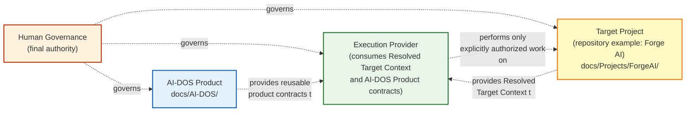
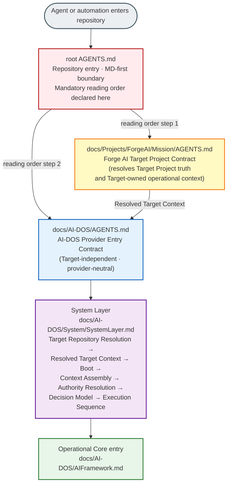
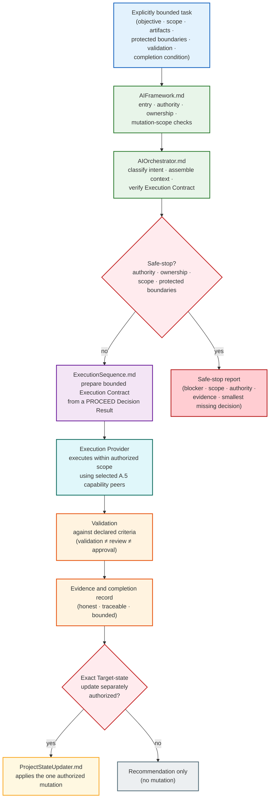
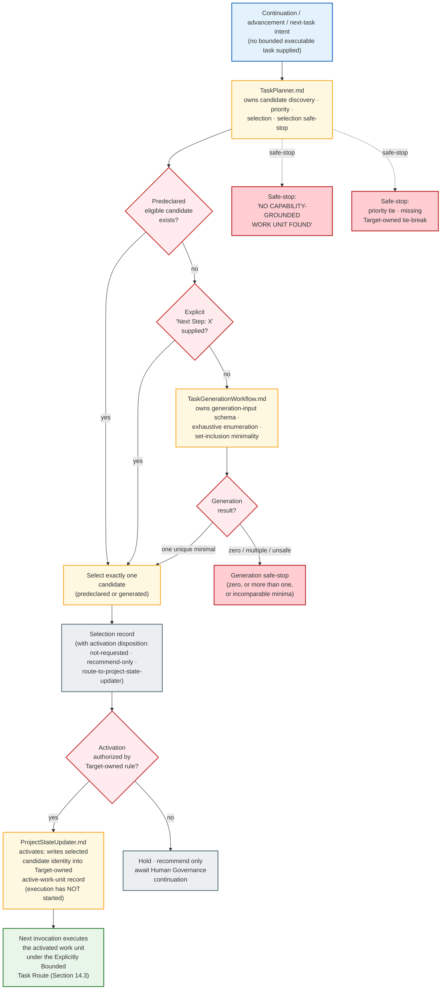
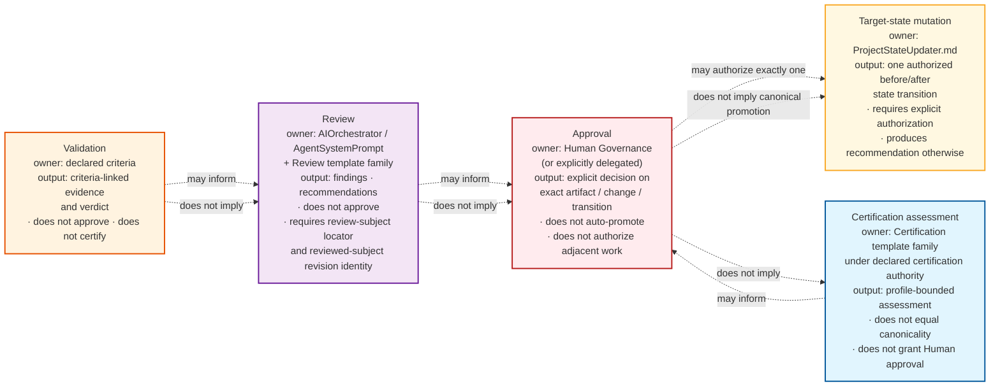

# AI-DOS System Overview

> Explanatory overview · Non-normative · Informative navigation aid

## Document Metadata

| Field | Value |
|:---|:---|
| Identifier | `AI-DOS.PRODUCT.OVERVIEW.SYSTEM-OVERVIEW` |
| Title | AI-DOS System Overview |
| Version | `0.2.0-draft` |
| Status | Draft |
| Lifecycle State | Draft |
| Canonical Status | Non-canonical; explanatory overview only. Governing artifacts prevail on any conflict. |
| Classification | AI-DOS Product Overview |
| Document Type | Explanatory Overview |
| Artifact Family | AI-DOS Product Artifact |
| Artifact Type | System Overview (Informative) |
| Owner | AI-DOS Product Governance |
| Maintainers | AI-DOS Product Governance |
| Review Authority | Framework Governance |
| Approval Authority | Human Governance |
| Normative Authority | Human Governance; `docs/AI-DOS/Architecture/Constitution/A.1-Constitution.md`; `docs/AI-DOS/GOVERNANCE.md`; `docs/AI-DOS/FrameworkGovernance.md` |
| Normative References | `docs/AI-DOS/AGENTS.md`; `docs/AI-DOS/AIFramework.md`; `docs/AI-DOS/AIOrchestrator.md`; `docs/AI-DOS/AgentSystemPrompt.md`; `docs/AI-DOS/System/SystemLayer.md`; `docs/AI-DOS/System/TargetRepositoryResolution.md`; `docs/AI-DOS/System/BootSequence.md`; `docs/AI-DOS/System/ExecutionSequence.md`; `docs/AI-DOS/Workflows/TaskPlanner.md`; `docs/AI-DOS/Workflows/TaskGenerationWorkflow.md`; `docs/AI-DOS/Workflows/ProjectStateUpdater.md` |
| Informative References | `docs/AI-DOS/README.md`; `docs/AI-DOS/Architecture/README.md`; `docs/AI-DOS/Architecture/RFC/Boundary/A.2-AI-DOS-Target-Repository-Operational-Boundary-RFC.md`; `docs/AI-DOS/Templates/TemplateIndex.md`; `docs/AI-DOS/Templates/TemplateLibrary.md`; `docs/AI-DOS/Architecture/Standards/STD-000-Framework-Standards.md`; `docs/AI-DOS/Architecture/Standards/STD-001-Knowledge-Graph-Standard.md`; `docs/AI-DOS/Architecture/Standards/STD-002-Discovery-Standard.md`; `docs/AI-DOS/Architecture/Standards/STD-003-Terminology-Standard.md`; `docs/AI-DOS/Architecture/Standards/STD-010-Document-Metadata-Standard.md`; `docs/AI-DOS/Architecture/Standards/STD-011-Target-Project-Standard.md`; `docs/AI-DOS/Architecture/Standards/STD-011-Target-Project-Conformance-Profile.md`; root `AGENTS.md`; `docs/Projects/ForgeAI/Mission/AGENTS.md` |
| Scope | Explanatory orientation to AI-DOS Product architecture, repository entry, Target Context resolution, provider entry, Operational Core routing, explicitly bounded and state-derived work routes, execution, validation, evidence, review, approval, state-mutation boundaries, release and repository integration boundaries, safe-stop model, navigation, and protected terminology for first-time readers, contributors, AI agents and automation, architecture reviewers, and Human Governance. |
| Out of Scope | Normative product contracts, governance decisions, Target Project operational state, implementation language choices, runtime or engine internals, distribution packaging mechanics, certification verdicts, canonical promotion, release authorization, merge authorization, Human Governance approval decisions, and any binding rule. This overview restates no normative rule; it only routes readers to the owning contracts. |
| Consumes | Governing AI-DOS Product contracts listed in Normative References for orientation; Forge AI Target Project contract only as the repository's current Target Project example. |
| Produces | This explanatory overview document. Produces no authority, no contract, no rule, no workflow, no lifecycle state, no validation result, no approval, no certification, and no canonical promotion. |
| Depends On | Governing AI-DOS Product contracts; root repository entry contract; the active Target Project contract. |
| Traceability ID | `AI-DOS.PRODUCT.OVERVIEW.SYSTEM-OVERVIEW` |
| Validation Profile | None — explicit non-applicability exception for this non-normative explanatory overview; no document-class validation profile currently applies. |
| Validation Status | Not validated by any M.9 validation profile. Structural and semantic review recorded in the accompanying audit report only. |
| Review Status | Review Required. This draft has not been reviewed or approved. |
| Certification Status | Not certified. |
| Compatibility Declaration | None. |
| Extension Profile | None. |
| Supersedes | Prior `docs/AI-DOS/SystemOverview.md` content for orientation purposes only. Does not supersede any normative authority. |
| Superseded By | None. |
| Last Updated | 2026-07-29 |

---

## 1. Purpose

This document is an explanatory, non-normative overview of AI-DOS. It helps first-time readers, contributors, AI agents and automation, architecture reviewers, and Human Governance develop a shared mental model of how the AI-DOS Product, a Target Project, and an Execution Provider interact under Human Governance.

It is not a normative contract. It does not define, override, refine, certify, promote, approve, or canonize any rule, role, status, workflow, lifecycle, command, gate, or authority. Every claim it makes is traceable to a governing artifact listed in the Document Metadata table above. When this overview and a governing Markdown contract differ, the contract prevails without exception.

The overview explains the system without becoming a competing normative contract. It uses canonical terminology and capitalization from `docs/AI-DOS/Architecture/Standards/STD-003-Terminology-Standard.md`. It preserves the distinctions protected by STD-003, including Artifact ≠ Document, Identity ≠ Identifier, Lifecycle State ≠ Operational State, Evidence ≠ Claim, Validation ≠ Review, Review ≠ Approval, Approval ≠ Canonical Promotion, Certification ≠ Canonicality, Target Project ≠ AI-DOS Product, Recommendation ≠ Authorization, Merge ≠ Target acceptance, and Repository presence ≠ active applicability.

The overview uses Forge AI only as the repository's current Target Project example where necessary. It does not embed transient Forge AI operational state, pull-request numbers, branch names, commit history, active tasks, phases, work-unit counts, or `ProjectStatus` values. Forge AI's specific operational facts are not reused as AI-DOS Product rules.

---

## 2. Authority and Interpretation Boundary

Authority in AI-DOS flows from Human Governance through the A.1 Constitution, the A.2 Product / Target Operational Boundary RFC, and the applicable Architecture, Meta, and Standards authorities. The canonical authority graph is owned by `docs/AI-DOS/GOVERNANCE.md` Section 3 and `docs/AI-DOS/FrameworkGovernance.md` Section 3, not by this overview. Readers needing authoritative statements of authority, ownership, precedence, and escalation must consult those two contracts.

The interpretation boundary declared by root `AGENTS.md` Section 3 and `docs/AI-DOS/AGENTS.md` Section 6 governs this overview as well. The presence of `package.json`, npm scripts, TypeScript, JavaScript, `src/`, `dist/`, tests, or CI workflows in the repository does not establish that AI-DOS is fundamentally a JavaScript, TypeScript, Node.js, or npm product, that `src/main.ts` is the AI-DOS engine or kernel, that implementation technology owns product or Target truth, or that passing implementation-specific checks validates the whole AI-DOS system. Current implementation artifacts are bounded, replaceable surfaces subordinate to the governing Markdown contracts.

This overview is informative. A diagram, table, list, or sentence in this document must never be read as creating authority, ownership, lifecycle state, validation verdict, review outcome, certification, approval, canonical promotion, release authorization, or merge authorization. Where this overview's wording is unclear, the governing artifact's wording prevails.

---

## 3. AI-DOS Product and Target Project Separation

AI-DOS is a reusable AI Operating System Product for governed AI-assisted work. A Target Project is an independent authority domain that consumes AI-DOS while retaining ownership of its own mission, planning, operational state, source, validation requirements, protected areas, evidence, and Human Governance decisions. An Execution Provider consumes applicable AI-DOS Product contracts and Resolved Target Context to perform only explicitly authorized work.

The truth-domain separation is owned by `docs/AI-DOS/Architecture/RFC/Boundary/A.2-AI-DOS-Target-Repository-Operational-Boundary-RFC.md` Section 1, `docs/AI-DOS/GOVERNANCE.md` Section 4, and `docs/AI-DOS/FrameworkGovernance.md` Section 4. This overview restates it only for orientation.

| Truth Domain | Owner | Boundary Rule (orientation only) |
|:---|:---|:---|
| AI-DOS Product truth | AI-DOS Product authority | Lives under `docs/AI-DOS/`. May enter governed releases only when approved. |
| Released AI-DOS Product truth | Release authority under A.6 for a specific version and channel | Immutable for that release identity. |
| Private development truth | AI-DOS development governance | Shall not enter a release implicitly. |
| Target Project truth | Target Project authority | Lives under the Target's own path (for Forge AI: `docs/Projects/ForgeAI/`). Shall not be absorbed into reusable AI-DOS Product truth. |
| Target operational state | Target Project authority | Shall not be mutated by AI-DOS by inference. |
| Runtime state | Runtime contract (A.3) | Does not equal Target Project state. |
| Engine state | Engine Platform contract (A.4) | Does not equal authorization or Target state. |
| Provider state | Execution Provider | Does not create AI-DOS Product or Target authority. |

Forge AI is the repository's Product Development Target Project. It is not AI-DOS itself. Its `ProjectStatus`, `DevelopmentPhases`, `Roadmap`, source state, evidence, memory, workflow state, registry state, local configuration, and protected areas remain Target-owned. Independent Target Projects must never inherit Forge AI paths, policies, planning, memory, workflow state, registry state, or local configuration. AI-DOS does not prescribe that every Target must use the artifact names Forge AI uses; those names belong only to Targets that choose them.

The first diagram in Section 14.1 visualizes this separation. The diagram is informative: it does not create the boundary; the A.2 Boundary RFC and the Governance Atlas do.

---

## 4. Repository Entry and Contract Discovery

Every AI agent or automation entering this repository begins at root `AGENTS.md`. That file is the repository entry and Target Contract discovery file. It identifies the repository, declares the MD-first interpretation boundary, points to the canonical Target Project Contract, points to the Execution Provider Contract, and declares the mandatory reading order. Root `AGENTS.md` Section 6 declares that mandatory order:

1. `docs/Projects/ForgeAI/Mission/AGENTS.md` resolves Target Project truth and Target-owned operational context.
2. `docs/AI-DOS/AGENTS.md` consumes the resolved Target Context as the execution provider.

Root `AGENTS.md` does not define provider internals and does not perform task selection, workflow routing, execution, validation, or state updates. It is purely an entry and discovery contract.

The canonical Forge AI Target Project Contract (`docs/Projects/ForgeAI/Mission/AGENTS.md`) owns Forge AI Target Project mission alignment, execution rules, protected areas, evidence requirements, autonomy safety, Target resources, and AI-DOS invocation responsibilities. It declares the Target Operational Entry (`docs/Projects/ForgeAI/Planning/ProjectStatus.md`) and the Forge AI state-derived work resolution policy. It does not identify, select, invoke, or configure an execution provider.

The Execution Provider Contract (`docs/AI-DOS/AGENTS.md`) accepts resolved Target Context and enters the AI-DOS Operational Core. It is Target-independent and provider-neutral. It routes execution through AI-DOS provider documents and does not own Target truth, define Target mission, define Target planning, define Target operational state, discover Target-specific paths, modify Target state automatically, or perform work selection itself.

The repository's single canonical Forge AI governance skill is `docs/Projects/ForgeAI/Skills/forge-ai-governance/SKILL.md`. Tool-specific skill adapters exist only to help a specific AI host discover this canonical skill; adapters are non-authoritative and must not restate, duplicate, or diverge from it.

Section 14.2 visualizes the repository-entry and provider-entry flow.

---

## 5. Target Context Resolution

Target Context Resolution is owned by the System Layer contract family under `docs/AI-DOS/System/SystemLayer.md`. The System Layer converts an explicit provider invocation and Target-supplied context into a bounded, authority-aware handoff for the AI-DOS Operational Core. It exists to resolve, assemble, validate, order, prepare, and hand off. It does not own product truth, Target truth, Runtime behavior, Engine behavior, distribution, governance approval, or Target operational state.

The canonical System Layer flow, owned by `SystemLayer.md` Section 7, is:

```text
Provider Invocation Contract
    ↓
Invocation Context
    ↓
Target Repository Resolution
    ↓
Resolved Target Context
    ↓
Boot / Context Loading
    ↓
Context Assembly
    ↓
Source-of-Truth Classification
    ↓
Authority Resolution
    ↓
Decision Model
    ↓
Execution Sequence
    ↓
Operational Core
```

Each step consumes the bounded output of the previous step. A later step shall not redefine an earlier owner. Missing authority, ownership, execution boundary, validation requirement, compatibility, or provider capability requires safe stop. No Forge AI fallback path or Target methodology may be inferred. No repository mutation begins before a bounded execution handoff exists.

`docs/AI-DOS/System/TargetRepositoryResolution.md` identifies the invoked Target Project, validates that the supplied repository boundary is coherent through its Deterministic Declaration Resolution Profile and six minimum declaration-coherence categories (target-resources, source-scope, protected-areas, validation, permissions-execution-authority, and safe-stop-behavior), and produces the resolution result consumed by Boot Sequence. It does not load the complete execution context, rank authorities, select work, authorize mutation, or infer Forge AI paths.

`docs/AI-DOS/System/BootSequence.md` loads the minimum inputs required to enter Context Assembly after Target Repository Resolution has completed. It does not rediscover the Target Repository, create Target declarations, select work, resolve authority conflicts, or execute capabilities.

The remaining System Layer components — `ContextAssembly.md`, `SourceOfTruth.md`, `AuthorityModel.md`, `AuthorityResolution.md`, `DecisionModel.md`, and `ExecutionSequence.md` — are sibling System Layer contracts whose filenames do not imply an authority hierarchy beyond the canonical flow. Each owns a bounded procedure and consumes higher authority without creating it.

Resolved Target Context is distinct from Target Repository Resolution Result. The Resolution Result identifies the Target boundary and resource references. Resolved Target Context contains task-relevant Target-owned objectives, constraints, authorities, execution boundaries, validation requirements, protected boundaries, and evidence. AI-DOS shall not prescribe Target Project resource names, planning documents, hierarchy, or methodology. Missing or ambiguous Target authority shall not be repaired with Forge AI fallback paths or assumptions.

---

## 6. AI-DOS Provider Entry

After Target Context Resolution completes, the Execution Provider Contract (`docs/AI-DOS/AGENTS.md`) consumes the Resolved Target Context and enters the AI-DOS Operational Core. The required provider route, owned by `docs/AI-DOS/AGENTS.md` Section 2, is:

```text
Resolved Target Context
    ↓
docs/AI-DOS/AIFramework.md
    ↓
docs/AI-DOS/AIOrchestrator.md
    ↓
docs/AI-DOS/AgentSystemPrompt.md
    ↓
Task-specific provider route
```

The provider entry contract is Target-independent. It does not own Target Project truth, define Target mission, define Target planning, define Target operational state, discover Target-specific paths, modify Target state automatically, replace AIFramework, replace AIOrchestrator, replace AgentSystemPrompt, perform work selection itself, or promote an implementation language into product authority.

For state-derived execution (when the invocation requests Target progress but does not provide a sufficiently bounded executable task), `docs/AI-DOS/AGENTS.md` Section 3 routes through:

```text
docs/AI-DOS/Workflows/TaskPlanner.md
    ↓
docs/AI-DOS/Workflows/TaskGenerationWorkflow.md when required
    ↓
Applicable Command
    ↓
docs/AI-DOS/System/ExecutionSequence.md
```

TaskPlanner must run before repository-derived work selection or editing. When continuation, advancement, or next-task intent reaches this entry, the entry routes the Resolved Target Context to `TaskPlanner.md`. `TaskPlanner.md` exclusively owns candidate eligibility, priority, selection, and its safe-stop record. When candidate construction is required, it delegates to `TaskGenerationWorkflow.md`, which exclusively owns the Target-owned generation-input schema, enumeration, minimality, and generation safe stops. This entry contract does not restate either workflow.

If TaskPlanner returns `NO CAPABILITY-GROUNDED WORK UNIT FOUND`, work stops before editing, commit, or pull request. Safe stop is a valid governed outcome.

---

## 7. Operational Core

The Operational Core is owned by three sibling contracts under `docs/AI-DOS/`: `AIFramework.md`, `AIOrchestrator.md`, and `AgentSystemPrompt.md`. They are not a sequential pipeline; they are authority-preserving contracts that constrain execution from different vantage points.

`docs/AI-DOS/AIFramework.md` is the single Operational Core entry contract. It consumes authority and architecture and does not create product truth, Target truth, release authority, execution authorization, validation authority, review authority, certification authority, or Human Governance approval. Its required inputs include Human or authorized task instruction, Invocation Context, Target Repository Resolution Result, Resolved Target Context, applicable AI-DOS authority and architecture, an explicit Execution Contract when mutation or external action is requested, and a provider capability declaration when provider behavior matters. Missing or contradictory authority requires safe stop.

`docs/AI-DOS/AIOrchestrator.md` coordinates one authorized work unit from resolved context to evidence-backed completion. It does not create authority, own Target planning truth, authorize execution by itself, approve results, certify artifacts, promote documents, release products, or mutate Target state by implication. It classifies intent, selects minimum required authorities, assembles bounded context, selects workflows, commands, templates, and capability peers, defines or verifies the Execution Contract, confirms provider capability and protected boundaries, coordinates execution, coordinates validation, coordinates review when required, collects completion evidence, and reports result, blockers, and next recommendation. Each step is conditional on relevance, but authority, ownership, mutation scope, and validation checks are never optional.

`docs/AI-DOS/AgentSystemPrompt.md` translates the Operational Core contract into tool-facing behavior. It is consumed by Execution Provider participants. It consumes authority and does not create it. It may inspect, plan, draft, edit, execute tools, validate, review, and recommend only within the active task, Resolved Target Context, explicit Execution Contract, provider capabilities, and protected boundaries.

The Operational Core consumes A.3 Runtime as the governed execution substrate and A.4 as the shared Engine Platform. A.5.x specializations are capability peers; their numbering is not an authority order or mandatory pipeline. The Operational Core selects only the specializations required by the active Execution Contract. A typical work unit may use Context, Knowledge, Planning, Decision, Execution, Validation, and Review capabilities, but no fixed universal pipeline is mandated.

Section 14.3 visualizes how an explicitly bounded task routes through this Operational Core.

---

## 8. Explicitly Bounded Task Route

When Human Governance supplies a sufficiently bounded task, the route is direct and does not invoke state-derived selection. The bounded task carries its own objective, authorized scope, expected artifacts or files, protected boundaries, validation requirements, and completion condition.

The explicitly bounded task route, owned by `docs/AI-DOS/AGENTS.md` Section 4 and `docs/AI-DOS/AIOrchestrator.md` Section 5, is:

```text
Explicitly bounded task
    ↓
Resolved Target Context + Invocation Context
    ↓
AIFramework entry, authority, ownership, mutation-scope checks
    ↓
AIOrchestrator orchestration lifecycle
    ↓
Execution Contract (assembled or verified)
    ↓
ExecutionSequence handoff
    ↓
Execution Provider within authorized scope
    ↓
Validation against declared criteria
    ↓
Evidence and completion record
    ↓
ProjectStateUpdater only when an exact Target-state update is separately authorized
```

An explicitly bounded task must not be replaced, broadened, or reinterpreted through state-derived work resolution. The bounded task remains the active Target instruction. AIOrchestrator may still validate authority, ownership, scope, protected boundaries, and validation requirements before executing. If any check fails, the route safe-stops rather than broadening the task.

The explicitly bounded task route does not always end in a Target-state mutation. Many bounded tasks are read, explain, inspect, audit, or review tasks that produce evidence only and mutate nothing. Some bounded tasks produce deliverables that do not require ProjectStatus updates. Section 12 explains why validation, review, completion, and Target-state mutation are distinct lifecycle actions that do not auto-progress.

Section 14.3 visualizes this route.

---

## 9. State-Derived Work Route

When the invocation requests Target progress, continuation, advancement, or next-task work but supplies no sufficiently bounded executable task, the state-derived work route applies. This route is owned jointly by the Target Project Contract (for Target-owned priority and candidate policy) and the AI-DOS provider workflows (for selection, generation, activation, and mutation mechanics).

For Forge AI specifically, the Target-owned policy is in `docs/Projects/ForgeAI/Mission/AGENTS.md` Sections 5.2 through 5.6. Other Target Projects may declare different policies; AI-DOS does not prescribe a universal Target planning model.

The provider-side route, owned by `docs/AI-DOS/AGENTS.md` Section 3, `docs/AI-DOS/Workflows/TaskPlanner.md`, `docs/AI-DOS/Workflows/TaskGenerationWorkflow.md`, `docs/AI-DOS/Workflows/ProjectStateUpdater.md`, and `docs/AI-DOS/System/ExecutionSequence.md`, is:

```text
Resolved Target Context + continuation/advancement/next-task intent
    ↓
TaskPlanner.md
    ├── predeclared eligible candidate found  → select exactly one
    ├── no predeclared eligible candidate     → delegate to TaskGenerationWorkflow.md
    │       ├── one unique minimal candidate  → return to TaskPlanner
    │       └── zero, or more than one, or unsafe → generation safe-stop
    ├── explicit `Next Step: X`               → resolve X (rank-bypass only)
    └── no eligible candidate                 → safe-stop: NO CAPABILITY-GROUNDED WORK UNIT FOUND
    ↓
Selection record (with activation disposition)
    ↓
ProjectStateUpdater.md only when the selection record authorizes one activation
    ↓
Activation: write the selected candidate's identity into the Target-owned active-work-unit record (when the Target contract declares one) — execution has not yet started
    ↓
Stop before executing work activated by that state transition
    ↓
A separate invocation executes the activated work unit under the Explicitly Bounded Task Route
```

`TaskPlanner.md` exclusively owns candidate discovery, normalization, classification, comparison, selection, issuance of exactly one candidate-generation request when no predeclared candidate is eligible, validation of generated-candidate authority and minimality, traceability from the selected candidate to explicit Target authority, and safe stop when no unique minimal candidate is authorized and sufficiently grounded.

`TaskGenerationWorkflow.md` exclusively owns construction of bounded candidate specifications from a Task Planner generation request, enumeration and canonicalization of capability-grounded candidates for one fixed objective, set-inclusion minimality comparison of candidate mutation-artifact sets, faithful translation of a selected work unit into an executable task specification, and selection of the narrowest applicable command route. It does not rank objectives, mutate Target state, issue an Execution Contract, activate work, execute work, or infer authority from repository convenience.

`ProjectStateUpdater.md` exclusively owns validation and application of the exact Target-state mutation in an authorized Execution Contract, preservation of the Target-owned state schema and transition constraints, and mutation evidence and completion reporting. It does not own Target operational state, planning model, lifecycle schema, or transition policy. It consumes intent resolved by AIOrchestrator and applicable Target-owned rules.

Activation is a distinct step from selection, generation, execution, review, and approval. The selected candidate is not executed by TaskPlanner. The activated work unit is not executed by ProjectStateUpdater. Execution requires a separate invocation under the explicitly bounded task route, with the activated work unit now serving as the bounded task. This separation prevents continuation intent from being silently converted into execution authority, approval authority, or merge authority.

Section 14.4 visualizes the state-derived planning route, including its safe-stop branches.

---
## 10. Execution, Validation, and Evidence

Execution begins only after a bounded Execution Contract exists. The Execution Contract is prepared by `docs/AI-DOS/System/ExecutionSequence.md`, which accepts only a valid `PROCEED` Decision Result and produces one bounded Execution Contract handed to the Operational Core and the selected Execution Provider. A valid Execution Contract contains the exact objective and authorized action, Target Repository and affected artifact boundary, applicable authority trace, selected provider and required capability, allowed and prohibited mutations, validation requirements, evidence requirements, stop and rollback conditions, completion condition, and (when applicable) the canonical review subject locator and reviewed-subject revision identity evidence.

Execution is performed by an Execution Provider within the authorized scope. The provider uses tools only for the authorized work unit, confirms destructive actions are within explicit authority, preserves existing user data and Target-owned truth, does not bypass Runtime, Engine Platform, governance, or Target boundaries through direct tool use, and reports tool failures honestly without fabricated results.

Validation is a distinct lifecycle action from execution, review, approval, certification, promotion, release, and merge. Validation evaluates declared criteria and produces criteria-linked evidence and a verdict. `docs/AI-DOS/AIFramework.md` Section 10 and `docs/AI-DOS/AIOrchestrator.md` Section 10 declare that validation does not approve, certify, promote, release, or mutate Target state. A passing test does not convert into approval, certification, promotion, release authorization, or Target acceptance.

Evidence is produced during and after execution. Evidence must be specific, traceable, and honest. Repository motion, documentation volume, commits, or passing tests do not by themselves prove Target progress. Evidence and Claim are distinct: a Claim asserts; Evidence supports, partially supports, contradicts, or leaves unverified. Traceability does not by itself prove a Claim.

The Operational Core completion contract, owned by `docs/AI-DOS/AIFramework.md` Section 10 and `docs/AI-DOS/AIOrchestrator.md` Section 12, requires every completed work unit to report scope completed, files or resources changed, authority consumed, validation performed and results, unresolved risks or blockers, exact lifecycle status without exaggeration, and a recommended next bounded action. Task completion is not certification, approval, promotion, release authorization, or Target-state acceptance.

---

## 11. Review, Approval, and State Mutation Boundaries

Review, approval, and Target-state mutation are distinct lifecycle actions with distinct owners and distinct authority effects. They must not be collapsed.

Review produces findings and recommendations. It does not certify, approve, promote, release, or mutate. Review is owned contextually by `docs/AI-DOS/AIOrchestrator.md` Section 10, `docs/AI-DOS/AgentSystemPrompt.md` Section 10, and the review-template family under `docs/AI-DOS/Templates/Review/`. When the task is to review an externally mutable subject, `docs/AI-DOS/AgentSystemPrompt.md` Section 10 and `docs/AI-DOS/System/ExecutionSequence.md` Section 2 require a complete canonical review subject locator, deterministic resolution of the complete canonical initial reviewed-subject revision identity through that locator before inspection, and deterministic re-resolution of the complete canonical final reviewed-subject revision identity through the same authoritative locator immediately before verdict handoff. Identity drift, an unresolvable locator or identity, or inability to complete final re-resolution is a blocking safe-stop condition, including for a read-only review.

Approval is an explicit Human Governance or explicitly delegated decision. It is owned by `docs/AI-DOS/FrameworkGovernance.md` Section 10. An approval decision shall identify the exact artifact, change, release, exception, or transition; the approved scope; the authority basis; the evidence considered; the conditions and exclusions; the resulting lifecycle effect; and the permitted follow-up. Approval does not authorize adjacent work by implication. Semantic approval intent may authorize only the uniquely derivable decision supported by current evidence and authority. If more than one valid transition exists, approval routing shall safe-stop.

Target-state mutation is owned by `docs/AI-DOS/Workflows/ProjectStateUpdater.md`. It applies one explicitly authorized mutation to a Target-owned operational-state artifact. It is a generic mutation route and does not require or prescribe ProjectStatus, DevelopmentPhases, Roadmap, phase, stage, or capability terminology. Without explicit authorization, it produces only a recommendation.

The Forge AI Target Project Contract (`docs/Projects/ForgeAI/Mission/AGENTS.md` Sections 5.5 and 5.6) binds these provider-owned mechanics to Forge-AI-specific Target-owned records: the Pending Human Governance Approval Subject in `ProjectStatus.md` Section 6.1, and the active work unit in `ProjectStatus.md` Sections 2 and 3. These bindings are Forge-AI-owned and are not reusable AI-DOS Product rules. Independent Target Projects may declare different bindings or no equivalent records.

The protected distinctions, owned by `docs/AI-DOS/Architecture/Standards/STD-003-Terminology-Standard.md` Section 13 and `docs/AI-DOS/FrameworkGovernance.md` Section 7, are:

| Distinction | Forbidden Collapse |
|:---|:---|
| Validation ≠ Review | Treating validation as human or governance review. |
| Review ≠ Approval | Treating review output as approval. |
| Approval ≠ Canonical Promotion | Treating approval as canonical status change. |
| Certification ≠ Canonicality | Treating certification as source-truth status. |
| Merge ≠ Target acceptance | Treating source-control merge as Target-state acceptance. |
| Recommendation ≠ Authorization | Treating a recommended next step as authority to act. |
| Completion ≠ Target-state transition | Treating task completion as ProjectStatus update authority. |

No state implies a later state. Continuation intent, completion, validation success, review passage, merge, installation, capability availability, registry presence, or repository activity does not automatically authorize any of: ProjectStatus update, DevelopmentPhases change, Roadmap change, lifecycle transition, certification, promotion, release, provider activation, or execution of a further work unit.

Section 14.5 visualizes these distinct lifecycle actions and the boundaries between them.

---

## 12. Release and Repository Integration Boundaries

Release is governed product publication under A.6 Distribution Foundation. A.6 is a sibling architectural branch to A.3 Runtime, A.4 Engine Platform, and A.5 Engine Specializations; it is not their downstream implementation. Release authority is owned by `docs/AI-DOS/FrameworkGovernance.md` Section 12 and the A.6 RFC family under `docs/AI-DOS/Architecture/RFC/Distribution/`.

A release decision shall identify the product version, release channel, included product truth, excluded private development and Target truth, manifest and provenance expectations, integrity expectations, compatibility declaration, rollback and uninstall policy, and approving authority. Release authorization does not authorize installation, execution, Target mutation, or provider activation unless separately authorized.

No Forge AI `ProjectStatus`, `DevelopmentPhases`, `Roadmap`, private source state, evidence, memory, workflow state, registry state, local configuration, or protected-area data may enter a release by implication. Release validation does not grant release approval. Installation does not grant Target mutation authority. Rollback and uninstall shall affect only AI-DOS-owned installed content unless a separate Target integration contract explicitly authorizes otherwise.

Repository integration actions — commits, branches, pull requests, merges — are source-control operations. They are not AI-DOS Product authority, not Target-state authority, not Human Governance approval, and not canonical promotion. `docs/AI-DOS/FrameworkGovernance.md` Section 7 declares that merge is not approval. `docs/AI-DOS/AgentSystemPrompt.md` Section 8 declares that when correcting review findings for an open pull request, the existing pull request head branch is the authorized mutation surface unless Human Governance explicitly authorizes a replacement pull request.

The repository-root file `PUBLIC_RELEASE_READINESS.md` is repository-root metadata, not an AI-DOS Product contract. It is not a release authority, not a Target-state authority, and not a Human Governance approval gate. Its presence at the repository root does not establish a universal AI-DOS release gate.

This overview does not represent release or merge as the terminal state of every execution. Many bounded tasks end with evidence only, with no release and no merge. Some bounded tasks end with a Target-state mutation authorized separately. Some bounded tasks end with a release authorized under A.6. Some bounded tasks end with a repository integration action authorized under the active Target Project contract. These are distinct terminal states with distinct authority requirements; they do not auto-progress.

---

## 13. Safe-Stop Model

Safe stop is a valid governed outcome. It is not a failure mode to be optimized away. The safe-stop model is owned by every contract in the governing chain, each with its own scoped safe-stop conditions.

`docs/AI-DOS/System/SystemLayer.md` Section 10 declares System Layer safe-stop conditions: the active Target cannot be resolved; Invocation Context is absent or materially ambiguous; Target authority inputs conflict; product truth and Target truth cannot be separated; required execution boundaries or validation requirements are missing; an Execution Contract is required but absent; the selected Execution Provider lacks a required capability; more than one materially different authorized decision remains unresolved; a protected boundary would be crossed; or release integrity, compatibility, provenance, or ownership is uncertain.

`docs/AI-DOS/AIFramework.md` Section 11 declares Operational Core safe-stop conditions: Target identity or Resolved Target Context is missing; ownership is ambiguous; product truth and Target truth conflict; required Execution Contract is absent; requested action exceeds Target Execution Boundaries; provider capability is insufficient; integrity or compatibility cannot be verified; more than one materially different next transition is possible; or Human Governance decision is required.

`docs/AI-DOS/AIOrchestrator.md` Section 11 and `docs/AI-DOS/AgentSystemPrompt.md` Section 12 declare additional safe-stop conditions including the review subject locator and reviewed-subject revision identity gates described in Section 11 of this overview.

`docs/AI-DOS/Workflows/TaskPlanner.md` Section 7 declares planning safe-stop conditions: planning authorization is absent; Target planning authority is absent or ambiguous; no predeclared candidate is eligible and `TaskGenerationWorkflow.md` returns a generation safe-stop; a generated-candidate or generation safe-stop record is missing, malformed, or lacks required provenance; more than one candidate shares the highest Target-owned priority; Target-owned priority semantics or tie behavior are missing; `Next Step: X` does not resolve to exactly one eligible candidate; or ownership, dependency, compatibility, validation, or protected boundaries are unresolved. A no-eligible-candidate result begins with `NO CAPABILITY-GROUNDED WORK UNIT FOUND`.

`docs/AI-DOS/Workflows/ProjectStateUpdater.md` Section 7 declares mutation safe-stop conditions: artifact identity, owner, schema, current state, transition rule, evidence, dependency, protected boundary, or exact mutation scope is missing or ambiguous; multiple transitions are valid; or the Target-owned rule requires further Human Governance action. It also declares specific safe-stop conditions for recording and resolving Pending Approval Subjects, including evidence-identity conflicts, identity drift, existing-record conflicts, and structural invalidity.

A safe-stop report shall state the blocker, the affected scope, the authority involved, the evidence available, and the smallest missing decision needed to proceed. The report does not authorize follow-up work by implication. Recommendations in a safe-stop report are non-authorizing.

---
## 14. Architecture Views

This section contains five bounded Mermaid diagrams. Each diagram has a declared purpose, uses labels grounded in actual repository terminology, avoids unsupported components or transitions, avoids implying authority from visual sequence alone, remains readable in GitHub Markdown, and uses valid Mermaid syntax.

Every diagram is informative. A diagram does not create authority, ownership, lifecycle state, validation verdict, review outcome, certification, approval, canonical promotion, release authorization, or merge authorization. Where a diagram and a governing contract differ, the contract prevails.

### 14.1 Product / Target Truth-Boundary Diagram

**Purpose:** orient readers to the four parties whose boundaries this overview preserves — Human Governance, AI-DOS Product, Target Project (Forge AI as the repository's current example), and Execution Provider — and to the truth domains each owns. The diagram is a static boundary view, not a workflow.



**Reading notes.** Dashed edges denote governance or contract-consumption relationships, not sequential execution. No party may silently transfer ownership between product truth and Target truth. Forge AI is shown as the repository's current example; independent Target Projects occupy the same boundary slot with their own Target-owned truth.

### 14.2 Repository-Entry and Provider-Entry Diagram

**Purpose:** show how an AI agent or automation enters the repository, resolves the Target Project Contract, consumes the Execution Provider Contract, and reaches the Operational Core entry. The diagram is an entry-flow view, not a workflow specification.



**Reading notes.** The reading order (root `AGENTS.md` → Target Project Contract → Provider Contract) is owned by root `AGENTS.md` Section 6. The System Layer flow shown compactly is owned by `SystemLayer.md` Section 7; this diagram does not redefine that flow. The Operational Core entry is owned by `AIFramework.md`; the next diagram and Section 7 expand on what happens inside it.

### 14.3 Explicitly Bounded Task Route

**Purpose:** show how a task that Human Governance has already bounded routes through the Operational Core without invoking state-derived selection. The diagram is an intent-classification view, not a sequential pipeline; safe-stop branches are equally valid outcomes.



**Reading notes.** Many bounded tasks are read, explain, inspect, audit, or review tasks that produce evidence only; for those, the `PSU_CHECK` branch returns `Recommendation only` and no mutation occurs. Completion is not Target-state acceptance. Validation is not review. Review is not approval.

### 14.4 State-Derived Planning and Safe-Stop Route

**Purpose:** show how continuation, advancement, or next-task intent routes through TaskPlanner and (when required) TaskGenerationWorkflow, and how ProjectStateUpdater separately owns activation. The diagram shows safe-stop branches as first-class outcomes. It is a planning view, not an execution pipeline; activation is distinct from execution.



**Reading notes.** TaskPlanner exclusively owns selection; TaskGenerationWorkflow exclusively owns generated-candidate construction; ProjectStateUpdater exclusively owns mutation. None of these three workflows executes the work unit. Activation writes identity into a Target-owned record; it does not execute. Execution requires a separate invocation under the explicitly bounded task route. Target-owned rules (for Forge AI, `docs/Projects/ForgeAI/Mission/AGENTS.md` Sections 5.2 through 5.6) supply the activation eligibility; AI-DOS does not prescribe a universal Target planning model.

### 14.5 Validation, Review, Approval, and State-Mutation Boundary Diagram

**Purpose:** show that validation, review, approval, and Target-state mutation are distinct lifecycle actions with distinct owners and distinct authority effects, and that no action auto-progresses into another. The diagram is a boundary view, not a pipeline; each action may end without invoking any later action.



**Reading notes.** Dashed directional `-.->` edges denote "may inform" or "may authorize exactly one" relationships, not automatic progression. Dashed `-. does not imply .->` edges mark the protected distinctions owned by STD-003 Section 13 and `FrameworkGovernance.md` Section 7. Merge, completion, installation, registry presence, capability availability, continuation intent, and repository activity are not authorization for any action shown.

---
## 15. Navigation Map

This navigation map helps readers find the owning contracts. The map is informative; it does not create authority, ownership, or lifecycle state. Each path has been verified to exist in the source repository.

### 15.1 Repository entry and reading order

| Area | Path | Role |
|:---|:---|:---|
| Repository entry | `AGENTS.md` | Repository identity, MD-first boundary, mandatory reading order. |
| Target Project Contract | `docs/Projects/ForgeAI/Mission/AGENTS.md` | Forge AI Target Project truth and Target-owned operational context. |
| Provider Entry Contract | `docs/AI-DOS/AGENTS.md` | AI-DOS Provider Entry; consumes Resolved Target Context. |
| Forge AI governance skill | `docs/Projects/ForgeAI/Skills/forge-ai-governance/SKILL.md` | Canonical Forge AI governance skill. |

### 15.2 AI-DOS Product navigation

| Area | Path | Role |
|:---|:---|:---|
| Product navigation | `docs/AI-DOS/README.md` | Active navigation entry for the reusable AI-DOS product. |
| Governance Atlas | `docs/AI-DOS/GOVERNANCE.md` | Governance navigation, authority map, ownership map. |
| Governance decision policy | `docs/AI-DOS/FrameworkGovernance.md` | Decision classification, lifecycle gates, approval policy. |
| Architecture navigation | `docs/AI-DOS/Architecture/README.md` | Architecture root navigation. |
| Constitution | `docs/AI-DOS/Architecture/Constitution/A.1-Constitution.md` | Constitutional authority. |
| Product / Target boundary | `docs/AI-DOS/Architecture/RFC/Boundary/A.2-AI-DOS-Target-Repository-Operational-Boundary-RFC.md` | Permanent product / Target / Execution Provider boundary. |
| RFC navigation | `docs/AI-DOS/Architecture/RFC/README.md` | Architecture RFC navigation. |

### 15.3 System Layer

| Area | Path | Role |
|:---|:---|:---|
| System Layer contract | `docs/AI-DOS/System/SystemLayer.md` | Canonical layer contract. |
| System Layer navigation | `docs/AI-DOS/System/README.md` | System Layer index. |
| Target Repository Resolution | `docs/AI-DOS/System/TargetRepositoryResolution.md` | Target boundary identification and validation. |
| Boot Sequence | `docs/AI-DOS/System/BootSequence.md` | Ordered loading of resolved inputs. |
| Context Assembly | `docs/AI-DOS/System/ContextAssembly.md` | Minimum sufficient, task-relevant context. |
| Source of Truth | `docs/AI-DOS/System/SourceOfTruth.md` | Truth-domain classification. |
| Authority Model | `docs/AI-DOS/System/AuthorityModel.md` | Authority categories and precedence. |
| Authority Resolution | `docs/AI-DOS/System/AuthorityResolution.md` | Authority resolution and conflict reporting. |
| Decision Model | `docs/AI-DOS/System/DecisionModel.md` | Bounded safe decision preparation. |
| Execution Sequence | `docs/AI-DOS/System/ExecutionSequence.md` | Execution Contract preparation and handoff. |
| System Layer freeze (historical) | `docs/AI-DOS/System/SystemLayerFreeze.md` | Historical freeze evidence; not a replacement for the layer contract. |

### 15.4 Operational Core

| Area | Path | Role |
|:---|:---|:---|
| Operational Core entry | `docs/AI-DOS/AIFramework.md` | Single Operational Core entry contract. |
| Orchestration | `docs/AI-DOS/AIOrchestrator.md` | Coordinates one authorized work unit. |
| Tool-facing behavior | `docs/AI-DOS/AgentSystemPrompt.md` | Translates the contract into tool-facing behavior. |

### 15.5 Workflows

| Area | Path | Role |
|:---|:---|:---|
| Task Planner | `docs/AI-DOS/Workflows/TaskPlanner.md` | Candidate discovery, priority, selection, selection safe-stop. |
| Task Generation Workflow | `docs/AI-DOS/Workflows/TaskGenerationWorkflow.md` | Candidate construction, enumeration, minimality, generation safe-stop. |
| Project State Updater | `docs/AI-DOS/Workflows/ProjectStateUpdater.md` | Authorized Target-state mutation. |

### 15.6 Templates

| Area | Path | Role |
|:---|:---|:---|
| Template Library index | `docs/AI-DOS/Templates/TemplateIndex.md` | Semantic navigation index. |
| Template Library contract | `docs/AI-DOS/Templates/TemplateLibrary.md` | Library authority boundary and semantic entry convention. |

Template selection is not task planning, workflow routing, command selection, execution authorization, approval, certification, promotion, release, persistence, or Target-state mutation. Template entry and index documents use semantic filenames; `README.md` is not a valid Template Library, family, authority, contract, or navigation entry document.

### 15.7 Commands

| Area | Path | Role |
|:---|:---|:---|
| Commands directory | `docs/AI-DOS/Commands/` | Bounded executable operations. Commands do not own architecture or Target state. |

### 15.8 Standards

| Area | Path | Role | Lifecycle Status |
|:---|:---|:---|:---|
| Framework Standards | `docs/AI-DOS/Architecture/Standards/STD-000-Framework-Standards.md` | Standards-family governance. | Draft; non-canonical. |
| Knowledge Graph Standard | `docs/AI-DOS/Architecture/Standards/STD-001-Knowledge-Graph-Standard.md` | Graph representation rules. | Draft; non-canonical. |
| Discovery Standard | `docs/AI-DOS/Architecture/Standards/STD-002-Discovery-Standard.md` | Discovery Artifact profile. | Draft; non-canonical. |
| Terminology Standard | `docs/AI-DOS/Architecture/Standards/STD-003-Terminology-Standard.md` | Canonical term labels and protected distinctions. | Draft; non-canonical. |
| Document Metadata Standard | `docs/AI-DOS/Architecture/Standards/STD-010-Document-Metadata-Standard.md` | Document-facing metadata fields. | Draft; non-canonical. |
| Target Project Standard | `docs/AI-DOS/Architecture/Standards/STD-011-Target-Project-Standard.md` | Reusable Target Project foundation. | Draft; non-canonical. |
| Target Project Conformance Profile | `docs/AI-DOS/Architecture/Standards/STD-011-Target-Project-Conformance-Profile.md` | STD-011 conformance validation profile. | Draft; non-canonical. |

Repository presence does not imply active or canonical status. Standards are not automatically canonical merely because they exist in the repository. This overview preserves each Standard's declared lifecycle, canonical status, authority, dependency, and approval boundaries and does not promote, certify, approve, or canonize any Standard.

### 15.9 Standards schemas and graph models

| Area | Path | Role | Lifecycle Status |
|:---|:---|:---|:---|
| Discovery Graph Model | `docs/AI-DOS/Architecture/Standards/Schemas/STD-002-Discovery-Graph-Model.md` | STD-002 graph projection. | Draft. |
| Discovery JSON Schema | `docs/AI-DOS/Architecture/Standards/Schemas/STD-002-Discovery-JSON-Schema.md` | STD-002 JSON schema. | Draft. |
| Discovery YAML Schema | `docs/AI-DOS/Architecture/Standards/Schemas/STD-002-Discovery-YAML-Schema.md` | STD-002 YAML schema. | Draft. |
| Discovery schema (JSON) | `docs/AI-DOS/Architecture/Standards/Schemas/STD-002-Discovery.schema.json` | STD-002 machine-readable schema. | Draft. |
| Discovery schema (YAML) | `docs/AI-DOS/Architecture/Standards/Schemas/STD-002-Discovery.schema.yaml` | STD-002 machine-readable schema. | Draft. |
| Terminology Graph Model | `docs/AI-DOS/Architecture/Standards/Schemas/STD-003-Terminology-Graph-Model.md` | STD-003 graph model. | Draft; candidate schema. |

Schemas and graph models are subordinate to their owning Standards. A schema or graph projection is not a source of truth and does not create authority.

### 15.10 Forge AI Target Project (example only)

| Area | Path | Role |
|:---|:---|:---|
| Forge AI Mission | `docs/Projects/ForgeAI/Mission/ForgeAI-Mission-Product-and-Autonomy-Model.md` | Mission, autonomy direction, strategic constraints. |
| Forge AI ProjectStatus | `docs/Projects/ForgeAI/Planning/ProjectStatus.md` | Live operational state and exactly authorized next action. |
| Forge AI DevelopmentPhases | `docs/Projects/ForgeAI/Planning/DevelopmentPhases.md` | Active capability boundary. |
| Forge AI Roadmap | `docs/Projects/ForgeAI/Planning/Roadmap.md` | Capability direction and dependencies. |
| Forge AI Reports | `docs/Projects/ForgeAI/Reports/` | Target Project operational evidence and findings. |

The Forge AI artifacts listed above are Target-owned. They are not reusable AI-DOS Product truth. They appear here only because Forge AI is the repository's current Target Project example.

---

## 16. Protected Terminology and Common Misinterpretations

This section orients readers to the protected distinctions owned by `docs/AI-DOS/Architecture/Standards/STD-003-Terminology-Standard.md` Section 13 and reinforced throughout the governing contracts. The list is informative; the canonical forbidden-synonym model is owned by STD-003.

| Canonical Distinction | Forbidden Collapse | Owning Authority |
|:---|:---|:---|
| Artifact ≠ Document | Treating a document representation as the artifact meaning. | STD-003; M.1. |
| Identity ≠ Identifier | Treating symbolic representation as semantic identity. | STD-003; M.2. |
| Relationship ≠ Edge | Treating graph representation as root relationship semantics. | STD-003; M.3; STD-001. |
| Lifecycle State ≠ Operational State | Treating runtime availability as lifecycle status. | STD-003; M.4. |
| Evidence ≠ Claim | Treating assertion as support proof. | STD-003; M.5. |
| Validation ≠ Review | Treating validation as human or governance review. | STD-003; M.9; FrameworkGovernance §7. |
| Review ≠ Approval | Treating review output as approval. | STD-003; M.4; FrameworkGovernance §7. |
| Approval ≠ Canonical Promotion | Treating approval as canonical status change. | STD-003; M.4; FrameworkGovernance §11. |
| Certification ≠ Canonicality | Treating certification as source-truth status. | STD-003; M.4; FrameworkGovernance §9. |
| Graph Node ≠ Artifact | Treating graph projection as artifact. | STD-003; STD-001 §8. |
| Discovery ≠ Finding | Treating intake as downstream finding. | STD-003; STD-002 §8. |
| Finding ≠ Recommendation | Treating observed issue as prescribed action. | STD-003. |
| Supersession ≠ Deletion | Treating replacement lineage as removal. | STD-003; M.6. |
| Registry Presence ≠ Approval | Treating registration as governance approval. | STD-003; FrameworkGovernance §14. |
| Target Project ≠ AI-DOS Product | Treating project vocabulary as reusable product truth. | STD-003; A.2; STD-011. |
| Recommendation ≠ Authorization | Treating a recommended next step as authority to act. | FrameworkGovernance §15; AIFramework §10. |
| Merge ≠ Target acceptance | Treating source-control merge as Target-state acceptance. | FrameworkGovernance §7; AgentSystemPrompt §13. |
| Repository presence ≠ active applicability | Treating file existence as canonical or operational status. | STD-000 §11; FrameworkGovernance §14. |

Common misinterpretations this overview explicitly rejects:

- That every execution ends in release or merge. Many bounded tasks end with evidence only.
- That validation, review, approval, certification, promotion, release, and merge form a single sequential pipeline. They are distinct lifecycle actions that do not auto-progress.
- That there is a universal Human Governance approval gate at every critical transition. Human Governance approval is required for protected transitions, constitutional change, canonical promotion, release authorization, and explicit exceptions, but it is not a universal gate invented by this overview.
- That implementation technology (JavaScript, TypeScript, Node.js, npm) is AI-DOS Product architecture. Implementation is bounded, replaceable, and subordinate to governing Markdown.
- That Forge AI's `ProjectStatus`, `DevelopmentPhases`, or `Roadmap` are reusable AI-DOS Product requirements. They are Forge-AI-owned Target Project artifacts.
- That a diagram in this overview is source truth. Diagrams are informative.
- That the existence of a Standard in the repository makes it canonical. Repository presence does not imply active or canonical status.
- That continuation intent, completion, validation success, review passage, merge, installation, capability availability, or registry presence authorizes Target-state mutation, lifecycle transition, certification, promotion, release, or execution of a further work unit.

---

## 17. Conformance and Validation Record

This section records the validation activities performed on this overview. It distinguishes structural validation, semantic review, standards-consistency assessment, repository path verification, and Mermaid syntax verification. None of these activities constitutes approval, certification, canonical promotion, or Human Governance acceptance.

### 17.1 Repository path verification

Every repository-relative path referenced in this overview was verified to exist against the source revision `bebc3f48f88d899df5a4a9d65d8b1715364efd62` of `https://github.com/doallon/forge-ai.git`. The verification covered the mandatory reading order, every System Layer component, every Operational Core component, every Workflow, the Template Library index and contract, the Standards family (STD-000, STD-001, STD-002, STD-003, STD-010, STD-011, STD-011 Conformance Profile), the Standards schemas and graph models, the Architecture README, Constitution, A.2 Boundary RFC, RFC README, the Commands directory, and the Forge AI Target Project artifacts referenced as the repository's current example. No path was found missing.

### 17.2 Structural validation

The document structure follows the recommended structure in the task specification: Document Metadata, Purpose, Authority and Interpretation Boundary, AI-DOS Product and Target Project Separation, Repository Entry and Contract Discovery, Target Context Resolution, AI-DOS Provider Entry, Operational Core, Explicitly Bounded Task Route, State-Derived Work Route, Execution, Validation, and Evidence, Review, Approval, and State Mutation Boundaries, Release and Repository Integration Boundaries, Safe-Stop Model, Architecture Views, Navigation Map, Protected Terminology and Common Misinterpretations, Conformance and Validation Record, and Related Authorities. The Document Metadata table follows STD-010 Section 8 field categories to the extent applicable to an explanatory overview that is not itself a Standard.

### 17.3 Semantic review

The semantic review confirmed that this overview does not collapse the protected distinctions listed in Section 16; does not present Target Project operational state as reusable AI-DOS Product truth; does not invent a universal Human Governance approval gate; does not imply that every execution ends in release or merge; does not treat implementation technology as product architecture; uses canonical terminology and capitalization; and links readers to the exact owning contracts rather than copying normative rules.

### 17.4 Standards-consistency assessment

- STD-000 boundary review: this overview declares itself non-normative and informative, declares that governing artifacts prevail on conflict, does not promote any draft Standard, does not treat repository presence as canonicality, and does not introduce Target Project phases, stages, queues, milestones, release schedules, `ProjectStatus`, `DevelopmentPhases`, or `Roadmap` authority into reusable AI-DOS Product rules.
- STD-003 terminology review: protected distinctions are preserved; canonical labels are used; no forbidden synonym collapses were introduced.
- STD-010 metadata review: the Document Metadata table declares Identifier, Title, Version, Status, Lifecycle State, Canonical Status, Classification, Document Type, Artifact Family, Artifact Type, Owner, Maintainers, Review Authority, Approval Authority, Normative Authority, Normative References, Informative References, Scope, Out of Scope, Consumes, Produces, Depends On, Traceability ID, Validation Profile, Validation Status, Review Status, Certification Status, Compatibility Declaration, Extension Profile, Supersedes, Superseded By, and Last Updated.
- STD-011 Target boundary review: Forge AI is used only as the repository's current Target Project example; Forge AI operational state is not embedded; Target-owned truth is not absorbed into reusable AI-DOS Product truth; the overview does not convert Forge-AI-specific operational facts into reusable AI-DOS Product rules.
- STD-001 graph and diagram semantics: each Mermaid diagram is declared informative, has a declared purpose, uses labels grounded in actual repository terminology, avoids unsupported components or transitions, and does not imply authority from visual sequence alone.
- STD-002 discovery boundary: no Discovery finding or audit observation is presented as a normative requirement in this overview.

### 17.5 Mermaid syntax verification

Each of the five Mermaid diagrams uses `flowchart TD` or `flowchart LR` syntax with bounded `classDef` style declarations, labeled nodes, labeled edges, and a declared purpose. The diagrams avoid classDef proliferation, avoid cross-layer connection duplication, and avoid legend subgraphs that compete with main content. The diagrams are intended to render correctly in GitHub Markdown.

### 17.6 What this validation is not

This validation is not approval. It is not certification. It is not canonical promotion. It is not Human Governance acceptance. It is not an M.9 validation result. It is not a Target Project conformance assessment. It is a structural, semantic, standards-consistency, repository-path, and Mermaid-syntax review recorded for traceability.

---

## 18. Related Authorities

This overview consumes the following authority artifacts for orientation. The list is informative and does not establish a dependency direction that the owning contracts do not already declare.

- Human Governance — final authority.
- `docs/AI-DOS/Architecture/Constitution/A.1-Constitution.md` — constitutional authority.
- `docs/AI-DOS/Architecture/RFC/Boundary/A.2-AI-DOS-Target-Repository-Operational-Boundary-RFC.md` — product / Target / Execution Provider boundary.
- `docs/AI-DOS/GOVERNANCE.md` — governance navigation and authority map.
- `docs/AI-DOS/FrameworkGovernance.md` — governance decision policy.
- `docs/AI-DOS/AGENTS.md` — AI-DOS Provider Entry Contract.
- `docs/AI-DOS/AIFramework.md` — Operational Core entry contract.
- `docs/AI-DOS/AIOrchestrator.md` — orchestration contract.
- `docs/AI-DOS/AgentSystemPrompt.md` — tool-facing behavior contract.
- `docs/AI-DOS/System/SystemLayer.md` and sibling System Layer components — invocation resolution and execution handoff.
- `docs/AI-DOS/Workflows/TaskPlanner.md`, `docs/AI-DOS/Workflows/TaskGenerationWorkflow.md`, `docs/AI-DOS/Workflows/ProjectStateUpdater.md` — bounded workflows.
- `docs/AI-DOS/Templates/TemplateIndex.md` and `docs/AI-DOS/Templates/TemplateLibrary.md` — template library.
- `docs/AI-DOS/Architecture/Standards/STD-000-Framework-Standards.md` through `STD-011-Target-Project-Conformance-Profile.md` — Standards family (all draft, non-canonical).
- Root `AGENTS.md` — repository entry.
- `docs/Projects/ForgeAI/Mission/AGENTS.md` — Forge AI Target Project Contract (Target-owned; example only).

When this overview and any of the above authorities differ, the authority prevails.
