# AI-DOS System Overview — Governance & Execution Flow

Explanatory overview of the governed path from agent entry through
execution, evidence, and Human Governance.

This document visualizes how AI-DOS product contracts and the active
Target Project (Forge AI) interact. It is not a normative contract.
When this overview and a governing Markdown contract differ, the
contract takes precedence.

| Domain | Truth root |
|:---|:---|
| AI-DOS product | `docs/AI-DOS/` |
| Forge AI Target Project | `docs/Projects/ForgeAI/` |
| Repository entry | root `AGENTS.md` |

Mandatory reading order for agents and automation:

1. `docs/Projects/ForgeAI/Mission/AGENTS.md` (Target Project truth)
2. `docs/AI-DOS/AGENTS.md` (Execution Provider)

```mermaid
flowchart TD
    %% ==========================================
    %% STYLE DEFINITIONS
    %% ==========================================
    classDef input fill:#e3f2fd,stroke:#1565c0,stroke-width:2px;
    classDef core fill:#f3e5f5,stroke:#6a1b9a,stroke-width:2px;
    classDef workflow fill:#fff3e0,stroke:#e65100,stroke-width:2px;
    classDef decision fill:#ffebee,stroke:#c62828,stroke-width:2px;
    classDef output fill:#e8f5e9,stroke:#2e7d32,stroke-width:2px;
    classDef boundary fill:#eceff1,stroke:#546e7a,stroke-width:2px,stroke-dasharray: 5 5;
    classDef critical fill:#ffcdd2,stroke:#b71c1c,stroke-width:2px;
    classDef target fill:#fff9c4,stroke:#fbc02d,stroke-width:2px;
    classDef product fill:#e1f5fe,stroke:#01579b,stroke-width:2px;
    classDef nav fill:#e8eaf6,stroke:#283593,stroke-width:2px;
    classDef skill fill:#f3e5f5,stroke:#6a1b9a,stroke-width:2px;
    classDef integration fill:#e0f7fa,stroke:#00695c,stroke-width:2px;

    %% ==========================================
    %% LAYER 1: FOUNDATIONAL ARCHITECTURE
    %% ==========================================
    subgraph L1_ARCH["Layer 1: Foundational Architecture & Reality"]
        A[AI-DOS<br>Reusable Product]:::product --> B[Forge AI<br>Development & Validation Target Project]:::target
        A --> D["Product Architecture<br>Reusable Contracts<br>docs/AI-DOS/"]:::product
        B --> C["Target Project Mission<br>Planning, Operational State<br>docs/Projects/ForgeAI/"]:::target
    end

    %% ==========================================
    %% LAYER 2: ENTRY & IDENTITY
    %% ==========================================
    subgraph L2_ENTRY["Layer 2: System Entry & Identity"]
        START([Agent / Automation Starts]) --> ROOT_AGENTS["root/AGENTS.md<br>Repository Identity & Boundary"]:::critical

        ROOT_AGENTS --> IDENTITY["Repository Identity:<br>- MD-first governed AI system<br>- Markdown artifacts are canonical"]:::boundary
        IDENTITY --> INTERPRET["Interpretation Boundary:<br>- package.json, TS/JS are bounded surfaces<br>- Subordinate to governing Markdown"]:::boundary

        INTERPRET --> TARGET_AGENTS["docs/Projects/ForgeAI/Mission/AGENTS.md<br>Canonical Target Project Contract"]:::target
    end

    %% ==========================================
    %% LAYER 3: TARGET PROJECT CONTRACT
    %% ==========================================
    subgraph L3_TARGET["Layer 3: Target Project Contract & Mandatory Order"]
        TARGET_AGENTS --> MISSION["Mission Alignment<br>Forge AI Purpose"]:::target
        TARGET_AGENTS --> PROTECTED["Protected Areas<br>What cannot be changed"]:::critical
        TARGET_AGENTS --> SAFETY["Autonomy Safety<br>Limits and controls"]:::critical

        TARGET_AGENTS --> ORDER["Mandatory Reading Order:"]:::critical
        ORDER --> STEP1["1. docs/Projects/ForgeAI/Mission/AGENTS.md<br>(Target Project Truth)"]:::target
        STEP1 --> STEP2["2. docs/AI-DOS/AGENTS.md<br>(Execution Provider)"]:::product
    end

    %% ==========================================
    %% LAYER 4: AI-DOS PRODUCT NAVIGATION
    %% ==========================================
    subgraph L4_NAV["Layer 4: AI-DOS Product Navigation"]
        STEP2 --> NAV["docs/AI-DOS/README.md<br>AI-DOS Navigation Entry"]:::nav
        NAV --> NAV_RULES["Consumption Rules:<br>Architecture defines reusable contracts<br>Operational docs consume them"]:::boundary
    end

    %% ==========================================
    %% LAYER 5: GOVERNANCE & ARCHITECTURE
    %% ==========================================
    subgraph L5_GOV["Layer 5: Governance & Architecture"]
        NAV --> GOV["docs/AI-DOS/GOVERNANCE.md<br>Governance Core"]:::core
        NAV --> FRAMEWORK_GOV["docs/AI-DOS/FrameworkGovernance.md<br>Governance Decision Policy"]:::core
        NAV --> ARCH["docs/AI-DOS/Architecture/README.md<br>Architecture Entry"]:::core

        ARCH --> CONST["docs/AI-DOS/Architecture/Constitution/A.1-Constitution.md<br>Constitution"]:::critical
        ARCH --> BOUNDARY["docs/AI-DOS/Architecture/RFC/Boundary/A.2-AI-DOS-Target-Repository-Operational-Boundary-RFC.md<br>Target Boundary RFC"]:::critical
    end

    %% ==========================================
    %% LAYER 6: SYSTEM LAYER & BOOT
    %% ==========================================
    subgraph L6_SYSTEM["Layer 6: System Layer & Boot Sequence"]
        NAV --> SYSTEM_LAYER["docs/AI-DOS/System/SystemLayer.md<br>System Layer Contract"]:::core
        NAV --> TARGET_RESOLUTION["docs/AI-DOS/System/TargetRepositoryResolution.md<br>Target Resolution"]:::core
        NAV --> BOOT["docs/AI-DOS/System/BootSequence.md<br>Boot Sequence"]:::core

        SYSTEM_LAYER --> BOOT
        TARGET_RESOLUTION --> BOOT
        BOOT --> CONTEXT["Resolved Target Context<br>Supplied to AI-DOS Provider"]:::input
    end

    %% ==========================================
    %% LAYER 7: OPERATIONAL CORE
    %% ==========================================
    subgraph L7_CORE["Layer 7: Operational Core"]
        CONTEXT --> AI_FRAMEWORK["docs/AI-DOS/AIFramework.md<br>AI-DOS Framework"]:::core
        AI_FRAMEWORK --> AI_ORCH["docs/AI-DOS/AIOrchestrator.md<br>Orchestration Engine"]:::core
        AI_ORCH --> AGENT_PROMPT["docs/AI-DOS/AgentSystemPrompt.md<br>Agent System Prompt"]:::core
        AGENT_PROMPT --> CMD{Command or Workflow?}:::decision
    end

    %% ==========================================
    %% LAYER 8: EXECUTION & TASK MANAGEMENT
    %% ==========================================
    subgraph L8_EXEC["Layer 8: Execution & Task Management"]
        CMD -- Commands --> CMDS["docs/AI-DOS/Commands/<br>Executable Operations"]:::workflow
        CMD -- Workflows --> WFS["docs/AI-DOS/Workflows/<br>Process Sequences"]:::workflow

        CMDS --> TASK_PLANNER["docs/AI-DOS/Workflows/TaskPlanner.md"]:::workflow
        WFS --> TASK_PLANNER

        TASK_PLANNER --> SAFE_STOP["Safe-Stop Checks<br>Boundaries, Authority, Evidence"]:::critical
        SAFE_STOP -- Pass --> EXEC_SEQ["docs/AI-DOS/System/ExecutionSequence.md"]:::core
        SAFE_STOP -- Fail --> HALT["HALT: No Action, Report"]:::critical
    end

    %% ==========================================
    %% LAYER 9: TEMPLATES, EVIDENCE & STATE
    %% ==========================================
    subgraph L9_EVIDENCE["Layer 9: Templates, Evidence & State Update"]
        NAV --> TEMPLATE_INDEX["docs/AI-DOS/Templates/TemplateIndex.md<br>Template Library Index"]:::nav
        TEMPLATE_INDEX --> TEMPLATE_LIB["docs/AI-DOS/Templates/TemplateLibrary.md<br>Template Library Contract"]:::nav

        EXEC_SEQ --> EVIDENCE["Create Validation Evidence"]:::target
        EVIDENCE --> TEMPLATE_LIB

        EVIDENCE --> STATE_UPDATE{Authorized State<br>Update Required?}:::decision
        STATE_UPDATE -- Yes --> PROJECT_STATE["docs/AI-DOS/Workflows/ProjectStateUpdater.md"]:::workflow
        STATE_UPDATE -- No --> RECOMMEND["Recommend State Update<br>No Change Applied"]:::output
    end

    %% ==========================================
    %% LAYER 10: FINAL GOVERNANCE & PRODUCTION RELEASE
    %% ==========================================
    subgraph L10_GOV["Layer 10: Final Human Governance & Production Release"]
        PROJECT_STATE --> HUMAN_GATE{Critical Lifecycle<br>Transition?}:::decision
        HUMAN_GATE -- Yes --> HUMAN_REVIEW["HUMAN GOVERNANCE REVIEW<br>Required"]:::critical
        HUMAN_GATE -- No --> RELEASE["Proceed to Release"]:::output

        HUMAN_REVIEW --> APPROVED{Human<br>Approved?}:::decision
        APPROVED -- No --> REJECT["Reject: Log Rationale<br>Target State Unchanged"]:::critical
        APPROVED -- Yes --> RELEASE

        RELEASE --> VISIBILITY["PUBLIC_RELEASE_READINESS.md<br>Visibility Criteria Check"]:::target
        VISIBILITY --> MERGE(["PRODUCTION RELEASE<br>State Updated & Merge"]):::critical
    end

    %% ==========================================
    %% CROSS-LAYER CONNECTIONS
    %% ==========================================
    L1_ARCH --> L2_ENTRY
    L2_ENTRY --> L3_TARGET
    L3_TARGET --> L4_NAV
    L4_NAV --> L5_GOV
    L5_GOV --> L6_SYSTEM
    L6_SYSTEM --> L7_CORE
    L7_CORE --> L8_EXEC
    L8_EXEC --> L9_EVIDENCE
    L9_EVIDENCE --> L10_GOV

    %% ==========================================
    %% INTEGRATION POINTS (AI-DOS ↔ Forge AI)
    %% ==========================================
    subgraph INTEGRATION["Integration Points: AI-DOS ↔ Forge AI"]
        I1["Target Context Resolution:<br>Forge AI provides context → AI-DOS consumes it"]:::integration
        I2["Evidence Flow:<br>AI-DOS generates evidence → Forge AI stores it"]:::integration
        I3["State Updates:<br>AI-DOS proposes updates → Forge AI applies with Human approval"]:::integration
        I4["Governance Chain:<br>Forge AI Mission → AI-DOS Provider → Human Review"]:::integration
    end
    TARGET_RESOLUTION -.-> I1
    EVIDENCE -.-> I2
    PROJECT_STATE -.-> I3
    TARGET_AGENTS -.-> I4

    %% ==========================================
    %% IMMUTABLE SYSTEM BOUNDARIES
    %% ==========================================
    subgraph BOUNDARIES["System's Immutable Boundaries"]
        B1["docs/AI-DOS/ owns reusable product truth"]:::boundary
        B2["docs/Projects/ForgeAI/ owns Target Project truth"]:::boundary
        B3["MD-first: Markdown is normative, not secondary"]:::critical
        B4["Human Governance is final decision authority"]:::critical
        B5["Implementation technology (JS/TS) is replaceable"]:::boundary
        B6["Template selection is not task planning, approval, or release"]:::boundary
        B7["Current capability != long-term vision"]:::boundary
    end
    NAV -.-> B1
    TARGET_AGENTS -.-> B2
    ROOT_AGENTS -.-> B3
    HUMAN_REVIEW -.-> B4
    INTERPRET -.-> B5
    TEMPLATE_INDEX -.-> B6
    MERGE -.-> B7

    %% ==========================================
    %% LEGEND
    %% ==========================================
    subgraph LEGEND["Legend & Color Codes"]
        direction LR
        L1["Red: Critical Boundaries & Human Authority"]:::critical
        L2["Blue: AI-DOS Product Truth"]:::product
        L3["Yellow: Forge AI Target Project Truth"]:::target
        L4["Green: Workflows & Processes"]:::workflow
        L5["Purple: Core Infrastructure"]:::core
        L6["Gray: Navigation & Templates"]:::nav
        L7["Teal: Integration Points"]:::integration
    end
```



## Related navigation

| Area | Path |
|:---|:---|
| AI-DOS product navigation | `docs/AI-DOS/README.md` |
| Governance | `docs/AI-DOS/GOVERNANCE.md` |
| Architecture | `docs/AI-DOS/Architecture/README.md` |
| System Layer | `docs/AI-DOS/System/SystemLayer.md` |
| Operational Core | `docs/AI-DOS/AIFramework.md` |
| Target Project contract | `docs/Projects/ForgeAI/Mission/AGENTS.md` |
| Repository entry | `AGENTS.md` (root) |

## Authority note

This overview is explanatory only. Normative behavior is defined exclusively by the governing Markdown contracts listed above. Human Governance remains the final decision authority for protected transitions and acceptance.
```
