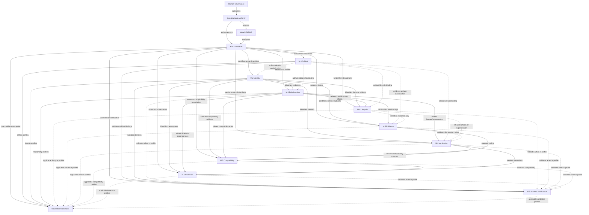

# AI-DOS Meta Enterprise Foundation v1

## 1. Document Metadata

| Field | Value |
|:---|:---|
| Identifier | `FORGE-AI.V2.AI-DOS-META-ENTERPRISE-FOUNDATION-001` |
| Title | AI-DOS Meta Enterprise Foundation v1 |
| Version | `1.0.0` |
| Status | Architecture Foundation Report |
| Owner | Human Governance |
| Author | Codex |
| Date | 2026-07-13 |
| Scope | Long-term Enterprise Meta Family architecture for AI-DOS. |
| Changed Artifact | `docs/AI/Architecture/Reports/AI-DOS-Meta-Enterprise-Foundation-v1.md` only. |
| In Scope | Meta Core responsibilities, enterprise Meta family boundaries, semantic ownership, dependency rules, downstream consumption, migration disposition, enterprise readiness, validation, and final verdict. |
| Out of Scope | Runtime behavior, Standards redesign, Agent behavior, Engine behavior, Operational Core behavior, command behavior, workflow behavior, template content, Target Project documents, implementation, refactor, and rewriting M.0 or M.1. |

---

## 2. Executive Summary

This report establishes a proposed Enterprise Meta Family Architecture candidate around the reconstructed Meta Core, ready for Human Governance review.

The current canonical Meta Core remains unchanged:

```text
docs/AI/Meta/
    README.md
    M.0-Framework-Meta-Model.md
    M.1-Artifact-Meta-Model.md
```

The Meta Core remains the semantic root. This foundation does not redesign M.0 or M.1. It defines how the Enterprise Meta Layer should grow around them so future Meta documents have stable ownership, dependency, consumption, and extension rules.

The proposed Enterprise Meta Family Architecture is a governed Meta family set:

```text
Meta Core
  README
  M.0 Framework
  M.1 Artifact
  M.2 Identity
  M.3 Relationships

Enterprise Semantic Profiles
  M.4 Lifecycle
  M.5 Evidence
  M.6 Versioning
  M.7 Compatibility
  M.8 Extension
  M.9 Schema & Validation
```

No evaluated family is merged. The minimum requested families are all retained because each owns a distinct enterprise semantic concern that would otherwise duplicate across downstream Standards, Runtime, Engine, Agents, Commands, Templates, Workflows, and Operational Core.

Final verdict and exactly one recommended next step are stated only in Sections 15 and 16.

---

## 3. Governing Assumptions

1. AI-DOS is a reusable framework product.
2. ForgeAI is a Target Project.
3. Target Projects consume AI-DOS.
4. AI-DOS never consumes Target Projects.
5. Meta owns meanings only.
6. Meta does not own implementation, runtime execution, engine execution, agent procedure, command execution, workflow execution, template content, operational procedure, or Target Project planning.
7. Human Governance remains the approval authority for Meta creation, promotion, amendment, certification, and deprecation.
8. The current Meta Core is the semantic foundation and must not be redesigned by this architecture report.

---

## 4. Architecture Principles

| Principle | Architecture Meaning |
|:---|:---|
| Semantic first | Meta defines meanings before downstream domains define rules, procedures, schemas, or execution. |
| Single semantic owner | Every reusable concept has exactly one Meta owner. Other families may bind to or consume it but may not redefine it. |
| Core preservation | M.0 and M.1 remain the semantic core; enterprise families extend around them. |
| Target independence | No Meta family may depend on ForgeAI or any other Target Project. |
| Downstream specialization | Downstream domains specialize Meta meanings within their own boundaries. |
| No procedure leakage | Meta meanings must not become runtime, engine, agent, command, workflow, or template procedures. |
| Governed DAG dependencies | Meta families form a governed directed acyclic graph; each family consumes only the semantic authorities required for its owned concern, and a later identifier does not automatically imply dependency on every lower-numbered family. |
| Validation readiness | The family sequence must eventually support machine-checkable schema and validation without turning Meta into tooling. |

---

## 5. Meta Core Architecture

### 5.1 Meta Family README

| Dimension | Definition |
|:---|:---|
| Responsibility | Owns Meta Family entry, reading order, authority boundary, downstream consumer list, and family overview. |
| Boundaries | Does not define framework semantics, artifact semantics, enterprise family details, implementation, procedures, or Target Project truth. |
| Consumers | All Meta readers and all downstream AI-DOS domains. |
| Non-goals | Runtime design, engine design, workflow execution, command execution, template content, project planning, Target Project status, migration procedure. |
| Authority | Navigational and family-entry authority under Human Governance. |

### 5.2 M.0 Framework Meta Model

| Dimension | Definition |
|:---|:---|
| Responsibility | Owns reusable AI-DOS framework root meanings: AI-DOS Product, Domain, Semantic Entity, Artifact root meaning, Actor, Capability, Context, Objective, Constraint, Boundary, Authority, Ownership, Relationship root meaning, Evidence root meaning, Decision, Finding, Recommendation, Risk, Extension root meaning, Validation root meaning. |
| Boundaries | Does not own artifact type-system details, runtime procedures, engine procedures, agent procedures, command execution, workflow execution, template content, planning, Target Project truth, or enterprise-family detailed contracts. |
| Consumers | M.1 through M.9, Constitution, Standards, Runtime, Engine, Agents, Commands, Templates, Workflows, Operational Core. |
| Non-goals | Implementation, storage, automation, procedural gates, schemas, Target planning, downstream domain design. |
| Authority | Framework semantic root authority under Human Governance and constitutional authority. |

### 5.3 M.1 Artifact Meta Model

| Dimension | Definition |
|:---|:---|
| Responsibility | Owns artifact-specific semantics: Artifact Family, Artifact Type, Artifact Instance, artifact bindings, Artifact Representation, Artifact Classification, Artifact Discovery Interface, and Artifact Consumption Interface. |
| Boundaries | Does not own relationship meaning, authority meaning, evidence meaning, compatibility meaning, lifecycle meaning, runtime semantics, agent semantics, planning artifacts, Target Project concepts, commands, workflows, or templates. |
| Consumers | M.2 through M.9 and all artifact-producing or artifact-consuming downstream domains. |
| Non-goals | Procedure, storage, registry implementation, validation tooling, downstream content models, Target-specific planning. |
| Authority | Artifact semantic authority derived from M.0 Artifact. |


### 5.4 Meta Core and Enterprise Semantic Profile Boundary

Meta Core consists of README, M.0, M.1, M.2, and M.3. These establish family navigation, framework meaning, artifact meaning, identity, and relationships.

Enterprise Semantic Profiles consist of M.4 Lifecycle, M.5 Evidence, M.6 Versioning, M.7 Compatibility, M.8 Extension, and M.9 Schema & Validation. These are first-class Meta authorities once approved by Human Governance, but downstream consumption is profile-driven according to domain need. This does not make the documents optional; it means a downstream domain consumes the approved authority when it uses the governed concern.

---

## 6. Enterprise Meta Family Evaluation and Definitions

### 6.1 Family Split Decision

| Evaluated Family | Decision | Justification |
|:---|:---|:---|
| M.2 Identity | Retain as dedicated family | Identity semantics are reused by every later family and cannot be safely embedded only in artifacts or downstream registries. |
| M.3 Relationships | Retain as dedicated family | Relationship direction, cardinality, transitivity, invalid-edge rules, and authority effects require one owner. |
| M.4 Lifecycle | Retain as dedicated family | Lifecycle, status, transition, canonicality, certification, deprecation, archival, and state-like meanings are enterprise-wide and should not duplicate in M.1, Standards, or Agents. |
| M.5 Evidence | Retain as dedicated family | Evidence identity, source, claim binding, validity, freshness, confidence, retention, and reproducibility need one reusable semantic owner. |
| M.6 Versioning | Retain as dedicated family | Version identity, lineage, supersession, replacement, migration obligation, and historical reference rules are distinct from compatibility and lifecycle. |
| M.7 Compatibility | Retain as dedicated family | Compatibility is a cross-version and cross-domain semantic relation, not merely version numbering or schema validation. |
| M.8 Extension | Retain as dedicated family | Extension namespaces, registration, collision prevention, product-purity boundaries, and federated extension semantics require a separate governance surface. |
| M.9 Schema & Validation | Retain as combined family | Schema and validation are merged because Meta validation readiness depends on structural expectations plus semantic conformance rules. This merge is justified because schemas without validation semantics are inert, and validation semantics without schema binding become duplicated in Standards. |

### 6.2 M.2 Identity

| Dimension | Definition |
|:---|:---|
| Purpose | Define stable identity semantics for AI-DOS semantic entities, artifacts, families, types, instances, actors, capabilities, contexts, evidence, decisions, relationships, versions, schemas, registries, and extensions. |
| Owned semantic concepts | Identity, identifier, identity scope, canonical reference, alias, external reference, collision, rename, move, identity persistence, version-independent reference, version-specific reference, registry entry identity. |
| Consumed concepts | M.0 Semantic Entity, Artifact, Actor, Capability, Context, Authority, Ownership, Boundary; M.1 Artifact Instance and artifact identity binding. |
| Produced concepts | Identity contract, uniqueness scope, alias rule, collision rule, canonical reference rule, historical identity rule. |
| Authority | Enterprise identity semantic authority. |
| Out of scope | Registry implementation, storage keys, URL routing, file paths as implementation, authentication identity, runtime session identity. |
| Downstream consumers | Standards, Runtime, Engine, Agents, Commands, Templates, Workflows, Operational Core, registries, discovery, validation, review. |
| Future extension points | Namespace profiles, external identifier bridges, federated registry identity, Target adapter identity boundary. |
| Dependency rules | Must depend on M.0; consumes M.1 only for artifact identity specialization; must not depend on relationships, lifecycle, evidence, versioning, compatibility, extension, or schema details. |

### 6.3 M.3 Relationships

| Dimension | Definition |
|:---|:---|
| Purpose | Define reusable relationship semantics between identified semantic entities and artifacts. |
| Owned semantic concepts | Relationship type, source, target, direction, cardinality, optionality, transitivity, symmetry, inverse relationship, invalid edge, cycle rule, relationship assertion, normative relationship, informative relationship, historical relationship, relationship authority effect. |
| Consumed concepts | M.0 Relationship root meaning, Semantic Entity, Boundary, Authority, Ownership, Constraint; M.1 Artifact Relationship Binding; M.2 Identity. |
| Produced concepts | Relationship contract, allowed-edge semantics, relationship assertion requirements, invalid-edge constraints, relationship graph interpretation rules. |
| Authority | Enterprise relationship semantic authority. |
| Out of scope | Knowledge graph storage, database edges, graph query language, runtime routing, engine orchestration, workflow order. |
| Downstream consumers | STD-001, STD-002, Runtime, Engine, Agents, Commands, Templates, Workflows, Operational Core, validation and review. |
| Future extension points | Domain relationship profiles, relationship taxonomies, impact analysis semantics, cross-repository relationship projection. |
| Dependency rules | Must depend on M.0 and M.2; consumes M.1 only for artifact relationship binding; must not redefine identity or infer lifecycle, evidence, versioning, or compatibility effects. |

### 6.4 M.4 Lifecycle

| Dimension | Definition |
|:---|:---|
| Purpose | Define lifecycle, status, transition, promotion, deprecation, archival, canonicality, certification, and historical-state semantics without defining downstream procedures. |
| Owned semantic concepts | Lifecycle profile, lifecycle state, status category, transition, transition authority, transition evidence requirement, promotion event, deprecation, superseded-state effect, archived, historical, canonical status, certification status, reversal, exception state, state classification boundary. |
| Consumed concepts | M.0 Authority, Ownership, Constraint, Boundary, Validation; M.1 Artifact Lifecycle Binding; M.2 Identity; M.3 Relationships. |
| Produced concepts | Lifecycle semantic contract, status-family separation, allowed-transition semantics, lifecycle evidence requirement semantics. |
| Authority | Enterprise lifecycle and status semantic authority. |
| Out of scope | Project planning, Target Project phase/stage, runtime active/inactive behavior, agent activation procedure, release management process, approval workflow mechanics. |
| Downstream consumers | Standards, Runtime, Engine, Agents, Commands, Templates, Workflows, Operational Core, governance records, validation and review. |
| Future extension points | Domain lifecycle profiles, regulated retention states, exception states, sunset policy semantics. |
| Dependency rules | Must depend on M.0, M.2, and M.3; consumes M.1 only for artifact lifecycle binding; must not redefine authority, identity, or relationship meanings. |

### 6.5 M.5 Evidence

| Dimension | Definition |
|:---|:---|
| Purpose | Define evidence semantics used to support claims, findings, decisions, validation results, review results, risks, recommendations, lifecycle transitions, compatibility declarations, and schema conformance. |
| Owned semantic concepts | Evidence item, evidence identity, evidence source, evidence subject, evidence claim, evidence assertion, evidence quality, validity, freshness, confidence, reproducibility, retention class, provenance, traceability, evidence chain, evidence sufficiency, evidence limitation. |
| Consumed concepts | M.0 Evidence, Decision, Finding, Recommendation, Risk, Validation, Authority, Context; M.1 evidence artifact classification and consumption interface; M.2 Identity; M.3 Relationships; M.4 Lifecycle transition evidence. |
| Produced concepts | Evidence contract, claim-evidence binding, traceability semantics, evidence quality semantics, evidence retention semantics. |
| Authority | Enterprise evidence and traceability semantic authority. |
| Out of scope | Evidence storage, log collection, test command execution, telemetry implementation, report template formats, approval decisions. |
| Downstream consumers | Standards, Runtime, Engine, Agents, Commands, Templates, Workflows, Operational Core, validation, review, certification, governance. |
| Future extension points | Regulated evidence profiles, confidence scoring profiles, reproducibility classes, retention policies, audit chain projections. |
| Dependency rules | Must depend on M.0, M.2, and M.3; consumes M.1 only for evidence artifact binding/classification; consumes M.4 only when evidence supports transitions; evidence supports authority but does not replace it. |

### 6.6 M.6 Versioning

| Dimension | Definition |
|:---|:---|
| Purpose | Define version, lineage, supersession, replacement, migration, historical reference, and versioned authority semantics for Meta and downstream artifacts. |
| Owned semantic concepts | Version, version scope, semantic version, document version, artifact version, schema version, model version, contract version, lineage, supersession, replacement, amendment, migration obligation, version window, versioned reference, immutable version reference, latest reference, rollback reference. |
| Consumed concepts | M.0 Artifact, Authority, Ownership, Boundary; M.1 Artifact Version Binding; M.2 Identity; M.3 supersession relationships; M.4 lifecycle states; M.5 evidence for version change. |
| Produced concepts | Versioning contract, supersession semantics, lineage semantics, migration-needed semantics, versioned-reference rules. |
| Authority | Enterprise versioning and supersession semantic authority. |
| Out of scope | Release process, package publication, deployment, changelog format, source-control mechanics. |
| Downstream consumers | Standards, Runtime, Engine, Agents, Commands, Templates, Workflows, Operational Core, schemas, validation, migration reports. |
| Future extension points | Compatibility windows, migration classes, release channel semantics, version federation across repositories. |
| Dependency rules | Must depend on M.0, M.2, and M.3; consumes M.1 only for artifact version binding; consumes M.4 for lifecycle effects of supersession; consumes M.5 only when version claims require evidence; compatibility consumes versioning, not the reverse. |

### 6.7 M.7 Compatibility

| Dimension | Definition |
|:---|:---|
| Purpose | Define compatibility semantics across AI-DOS versions, artifacts, schemas, runtime contracts, engine contracts, agent contracts, commands, templates, workflows, operational contracts, and Target integration boundaries. |
| Owned semantic concepts | Compatibility relation, compatible-with, incompatible-with, backward compatibility, forward compatibility, partial compatibility, conditional compatibility, breaking change, non-breaking change, compatibility claim, compatibility evidence requirement, compatibility window, adapter compatibility, Target boundary compatibility. |
| Consumed concepts | M.0 Boundary, Constraint, Capability, Validation, Evidence; M.1 Artifact Consumption Interface; M.2 Identity; M.3 Relationships; M.4 Lifecycle; M.5 Evidence; M.6 Versioning. |
| Produced concepts | Compatibility contract, compatibility declaration semantics, compatibility evidence semantics, breaking-change semantics. |
| Authority | Enterprise compatibility semantic authority. |
| Out of scope | Runtime behavior, adapter implementation, migration tooling, release approval procedure, specific backward-compatibility guarantees for downstream domains. |
| Downstream consumers | Standards, Runtime, Engine, Agents, Commands, Templates, Workflows, Operational Core, extension governance, schema validation, migration planning. |
| Future extension points | Compatibility profiles per domain, contract compatibility matrices, Target adapter compatibility classes, support windows. |
| Dependency rules | Must depend on M.0, M.2, M.3, M.5, and M.6; must not redefine versioning; compatibility claims require M.5 evidence semantics. |

### 6.8 M.8 Extension

| Dimension | Definition |
|:---|:---|
| Purpose | Define governed extension semantics for adding families, types, relationships, lifecycle profiles, evidence profiles, compatibility profiles, schemas, and domain specializations without replacing upstream meanings. |
| Owned semantic concepts | Extension, extension point, extension namespace, extension registration, extension authority, extension boundary, extension collision, extension profile, extension dependency, extension compatibility declaration, extension deprecation, federated extension, Target adapter extension boundary. |
| Consumed concepts | M.0 Extension root meaning, Boundary, Authority, Ownership; M.1 Artifact Family and Artifact Type; M.2 Identity; M.3 Relationships; M.4 Lifecycle; M.5 Evidence; M.6 Versioning; M.7 Compatibility. |
| Produced concepts | Extension contract, namespace rule, registration semantics, collision handling semantics, Target-independent extension boundary. |
| Authority | Enterprise extension semantic authority. |
| Out of scope | Plugin implementation, package loading, registry tooling, runtime adapter behavior, Target-specific customization content. |
| Downstream consumers | Standards, Runtime, Engine, Agents, Commands, Templates, Workflows, Operational Core, schema owners, external Target adapters. |
| Future extension points | Extension marketplaces, federated governance models, domain extension profiles, regulated extension approval classes. |
| Dependency rules | Must depend on M.0, M.2, M.3, M.6, and M.7; consumes other families only when an extension profile uses them; Target extensions must remain outside AI-DOS product truth unless generalized and governed. |

### 6.9 M.9 Schema & Validation

| Dimension | Definition |
|:---|:---|
| Purpose | Define schema binding, semantic conformance, validation target, validation rule, validation result, validation evidence, validation scope, and validation failure semantics for Meta-family and downstream consumption. |
| Owned semantic concepts | Schema, schema binding, schema version binding, validation target, validation scope, validation rule, validation assertion, validation result, pass, fail, warning, waived finding, conformance, non-conformance, semantic validation, structural validation, authority validation, relationship validation, lifecycle validation, evidence validation, compatibility validation, extension validation. |
| Consumed concepts | M.0 Validation, Evidence, Constraint, Boundary; M.1 Artifact Schema Binding; M.2 Identity; applicable semantic families being validated, such as M.3 Relationships, M.4 Lifecycle, M.5 Evidence, M.6 Versioning, M.7 Compatibility, or M.8 Extension when included in the active profile. |
| Produced concepts | Schema and validation semantic contract, conformance semantics, validation-result semantics, machine-readiness boundary. |
| Authority | Enterprise schema and validation semantic authority. |
| Out of scope | Specific JSON/YAML schema syntax, validators, CI commands, test runners, runtime enforcement, implementation details, Standards procedures. |
| Downstream consumers | Standards, Runtime, Engine, Agents, Commands, Templates, Workflows, Operational Core, validation tooling, review, certification. |
| Future extension points | Domain schema profiles, validation rule catalogs, validation severity profiles, conformance certification profiles. |
| Dependency rules | Must depend on M.0, M.1, M.2, and the applicable semantic families being validated; must not consume every family when a schema profile validates only a subset; may bind schemas to Meta semantics but must not define downstream implementation behavior. |

---

## 7. Meta Family Dependency Graph

Meta families form a governed directed acyclic graph. Each family consumes only the semantic authorities required for its owned concern. A later identifier does not automatically imply dependency on every lower-numbered family.



### 7.1 Dependency Rules

1. M.0 is the root authority and may consume only Human Governance and constitutional authority.
2. M.1 consumes M.0 and specializes artifact meaning without redefining M.0 concepts.
3. M.2 consumes M.0 and consumes M.1 only for artifact identity specialization.
4. M.3 consumes M.0 and M.2, and consumes M.1 only for artifact relationship binding.
5. M.4 consumes M.0, M.2, and M.3, and consumes M.1 only for artifact lifecycle binding.
6. M.5 consumes M.0, M.2, and M.3; consumes M.1 only for evidence artifact binding/classification; consumes M.4 only when evidence supports transitions.
7. M.6 consumes M.0, M.2, and M.3; consumes M.1 only for artifact version binding; consumes M.4 for lifecycle effects of supersession; consumes M.5 only when version claims require evidence.
8. M.7 consumes M.0, M.2, M.3, M.5, and M.6.
9. M.8 consumes M.0, M.2, M.3, M.6, and M.7; it consumes other families only when an extension profile uses them.
10. M.9 consumes M.0, M.1, M.2, and the applicable semantic families being validated; it must not consume every family when a schema profile validates only a subset.
11. No family may consume a later family as a prerequisite.
12. Downstream domains consume applicable Meta profiles; they do not become Meta authorities.

### 7.2 Selective Dependency Matrix

| Family | Required Upstream | Conditional Upstream | Must Not Consume |
|:---|:---|:---|:---|
| M.0 Framework | Human Governance; constitutional authority | None | Target Project authority; downstream domain procedures |
| M.1 Artifact | M.0 | None | M.2-M.9 as prerequisites |
| M.2 Identity | M.0 | M.1 for artifact identity specialization | M.3-M.9 |
| M.3 Relationships | M.0; M.2 | M.1 for artifact relationship binding | M.4-M.9 |
| M.4 Lifecycle | M.0; M.2; M.3 | M.1 for artifact lifecycle binding | M.5-M.9 |
| M.5 Evidence | M.0; M.2; M.3 | M.1 for evidence artifact binding/classification; M.4 when evidence supports transitions | M.6-M.9 |
| M.6 Versioning | M.0; M.2; M.3 | M.1 for artifact version binding; M.4 for lifecycle effects of supersession; M.5 when version claims require evidence | M.7-M.9 |
| M.7 Compatibility | M.0; M.2; M.3; M.5; M.6 | None | M.8-M.9 |
| M.8 Extension | M.0; M.2; M.3; M.6; M.7 | Other families only when an extension profile uses them | M.9 as a universal prerequisite |
| M.9 Schema & Validation | M.0; M.1; M.2 | Applicable semantic families being validated | Families outside the active schema or validation profile |


## 8. Semantic Ownership Matrix

| Order | Family | Exclusive Semantic Ownership | Consumes | Produces |
|:---:|:---|:---|:---|:---|
| Entry | README | Meta navigation, reading order, family overview, entry authority boundary | Human Governance, constitutional authority | Meta family map |
| M.0 | Framework | AI-DOS root framework meanings and root semantic concepts | Human Governance, constitutional authority | Framework semantic vocabulary |
| M.1 | Artifact | Artifact family/type/instance, artifact bindings, representation, classification, discovery interface, consumption interface | M.0 | Artifact semantic contract |
| M.2 | Identity | Identity scope, identifiers, aliases, canonical references, collisions, persistence, registry entry identity | M.0; M.1 only for artifact identity specialization | Identity contract |
| M.3 | Relationships | Relationship types, direction, cardinality, transitivity, invalid edges, relationship assertions | M.0; M.2; M.1 only for artifact relationship binding | Relationship contract |
| M.4 | Lifecycle | Lifecycle profiles, statuses, transitions, canonicality, certification state, deprecation, archival, historical state | M.0; M.2; M.3; M.1 only for artifact lifecycle binding | Lifecycle/status contract |
| M.5 | Evidence | Evidence item, source, subject, claim, validity, freshness, confidence, reproducibility, retention, traceability | M.0; M.2; M.3; M.1 for evidence artifacts; M.4 when evidence supports transitions | Evidence and traceability contract |
| M.6 | Versioning | Version scope, lineage, supersession, replacement, migration obligation, versioned references | M.0; M.2; M.3; M.1 for artifact versions; M.4 for supersession effects; M.5 for evidenced version claims | Versioning and supersession contract |
| M.7 | Compatibility | Compatibility relations, breaking/non-breaking change, compatibility claims, compatibility windows | M.0; M.2; M.3; M.5; M.6 | Compatibility contract |
| M.8 | Extension | Extension point, namespace, registration, collision handling, extension boundary, federated extension | M.0; M.2; M.3; M.6; M.7; other families only when profile uses them | Extension contract |
| M.9 | Schema & Validation | Schema binding semantics, validation scope/rules/results/conformance/failure semantics | M.0; M.1; M.2; applicable semantic families being validated | Schema and validation contract |

### 8.1 Ownership Chain

```text
M.0 owns root meaning.
  ↓
M.1 owns artifact meaning derived from root Artifact.
  ↓
M.2 owns stable identity for root and artifact entities.
  ↓
M.3 owns typed relationships between identified entities.
  ↓
M.4 owns lifecycle/status meaning for identified and related entities.
  ↓
M.5 owns evidence and traceability for claims about entities, relationships, and lifecycle events.
  ↓
M.6 owns versions and supersession of entities and artifacts.
  ↓
M.7 owns compatibility across versions and contracts.
  ↓
M.8 owns safe extension of applicable governed semantics without replacing upstream authorities.
  ↓
M.9 owns schema binding and validation semantics over the applicable semantic families included in a validation profile.
```

---

## 9. Domain Consumption Profiles and Matrix

### 9.1 Consumption Profile Definitions

| Profile | Definition |
|:---|:---|
| CORE REQUIRED | The domain cannot establish valid identity, artifact meaning, or core semantics without it. |
| PROFILE REQUIRED | Required only when the domain uses the concern governed by that Meta family. |
| CONDITIONAL | Required when a specific feature, artifact, claim, compatibility surface, or extension exists. |
| INFORMATIVE | Useful for interpretation but not a normative dependency. |
| NOT APPLICABLE | The domain does not consume that concern. |

### 9.2 Consumption Profile Matrix

| Domain | Family | Profile | Trigger / Reason |
|:---|:---|:---|:---|
| Standards | README | CORE REQUIRED | Family navigation and authority entry. |
| Standards | M.0 Framework | CORE REQUIRED | Root framework meaning. |
| Standards | M.1 Artifact | CORE REQUIRED | Artifact meaning and bindings. |
| Standards | M.2 Identity | CORE REQUIRED | Stable identity for consumed or produced semantic entities. |
| Standards | M.3 Relationships | CORE REQUIRED | Relationship meaning among identified entities. |
| Standards | M.4 Lifecycle | PROFILE REQUIRED | When standards define status, canonicality, certification, or transition semantics. |
| Standards | M.5 Evidence | PROFILE REQUIRED | When standards produce claims, findings, validation results, or review evidence. |
| Standards | M.6 Versioning | PROFILE REQUIRED | When standards define versioned contracts, supersession, or migration obligations. |
| Standards | M.7 Compatibility | PROFILE REQUIRED | When standards expose versioned contracts or cross-version consumption. |
| Standards | M.8 Extension | CONDITIONAL | When standards define extension points, namespaces, profiles, or adapters. |
| Standards | M.9 Schema & Validation | PROFILE REQUIRED | When machine-readable conformance or governed validation exists. |
| Runtime | README | CORE REQUIRED | Family navigation and authority entry. |
| Runtime | M.0 Framework | CORE REQUIRED | Root framework meaning. |
| Runtime | M.1 Artifact | CORE REQUIRED | Artifact meaning and bindings. |
| Runtime | M.2 Identity | CORE REQUIRED | Stable identity for consumed or produced semantic entities. |
| Runtime | M.3 Relationships | CORE REQUIRED | Relationship meaning among identified entities. |
| Runtime | M.4 Lifecycle | PROFILE REQUIRED | When runtime contracts distinguish active, deprecated, archived, or transition-bound meanings. |
| Runtime | M.5 Evidence | CONDITIONAL | When runtime produces claims, logs, validation results, or operational evidence. |
| Runtime | M.6 Versioning | PROFILE REQUIRED | When runtime exposes versioned contracts or runtime artifact versions. |
| Runtime | M.7 Compatibility | PROFILE REQUIRED | When runtime exposes compatibility surfaces across versions or adapters. |
| Runtime | M.8 Extension | CONDITIONAL | When runtime exposes plugins, adapters, extension points, or custom namespaces. |
| Runtime | M.9 Schema & Validation | PROFILE REQUIRED | When runtime conformance is machine-validated or schema-bound. |
| Engine | README | CORE REQUIRED | Family navigation and authority entry. |
| Engine | M.0 Framework | CORE REQUIRED | Root framework meaning. |
| Engine | M.1 Artifact | CORE REQUIRED | Artifact meaning and bindings. |
| Engine | M.2 Identity | CORE REQUIRED | Stable identity for consumed or produced semantic entities. |
| Engine | M.3 Relationships | CORE REQUIRED | Relationship meaning among identified entities. |
| Engine | M.4 Lifecycle | PROFILE REQUIRED | When engine contracts use lifecycle states or transition effects. |
| Engine | M.5 Evidence | CONDITIONAL | When engine outputs claims, findings, traces, or validation evidence. |
| Engine | M.6 Versioning | PROFILE REQUIRED | When engine contracts or capabilities are versioned. |
| Engine | M.7 Compatibility | PROFILE REQUIRED | When engine capability contracts are cross-version or cross-domain. |
| Engine | M.8 Extension | CONDITIONAL | When engine exposes extension points or adapter profiles. |
| Engine | M.9 Schema & Validation | PROFILE REQUIRED | When engine contracts have governed validation or schema profiles. |
| Agents | README | CORE REQUIRED | Family navigation and authority entry. |
| Agents | M.0 Framework | CORE REQUIRED | Root framework meaning. |
| Agents | M.1 Artifact | CORE REQUIRED | Artifact meaning and bindings. |
| Agents | M.2 Identity | CORE REQUIRED | Stable identity for consumed or produced semantic entities. |
| Agents | M.3 Relationships | CORE REQUIRED | Relationship meaning among identified entities. |
| Agents | M.4 Lifecycle | PROFILE REQUIRED | When agent definitions have lifecycle, status, certification, or deprecation semantics. |
| Agents | M.5 Evidence | PROFILE REQUIRED | When agents produce findings, reviews, validation results, or execution evidence. |
| Agents | M.6 Versioning | PROFILE REQUIRED | When agent contracts or definitions are versioned. |
| Agents | M.7 Compatibility | CONDITIONAL | When agents consume or expose cross-version contracts. |
| Agents | M.8 Extension | CONDITIONAL | When agent specializations, tools, adapters, or extension profiles exist. |
| Agents | M.9 Schema & Validation | PROFILE REQUIRED | When agent definitions or outputs are governed by machine-readable validation. |
| Commands | README | CORE REQUIRED | Family navigation and authority entry. |
| Commands | M.0 Framework | CORE REQUIRED | Root framework meaning. |
| Commands | M.1 Artifact | CORE REQUIRED | Artifact meaning and bindings. |
| Commands | M.2 Identity | CORE REQUIRED | Stable identity for consumed or produced semantic entities. |
| Commands | M.3 Relationships | CORE REQUIRED | Relationship meaning among identified entities. |
| Commands | M.4 Lifecycle | CONDITIONAL | When command definitions carry status, deprecation, or transition semantics. |
| Commands | M.5 Evidence | PROFILE REQUIRED | When commands produce execution evidence, claims, findings, or validation results. |
| Commands | M.6 Versioning | PROFILE REQUIRED | When commands are versioned or superseded. |
| Commands | M.7 Compatibility | CONDITIONAL | When command inputs/outputs are consumed across versions. |
| Commands | M.8 Extension | CONDITIONAL | When command namespaces, plugins, or adapters exist. |
| Commands | M.9 Schema & Validation | PROFILE REQUIRED | When command inputs/outputs are schema-bound or conformance-validated. |
| Templates | README | CORE REQUIRED | Family navigation and authority entry. |
| Templates | M.0 Framework | CORE REQUIRED | Root framework meaning. |
| Templates | M.1 Artifact | CORE REQUIRED | Artifact meaning and bindings. |
| Templates | M.2 Identity | CORE REQUIRED | Stable identity for consumed or produced semantic entities. |
| Templates | M.3 Relationships | CORE REQUIRED | Relationship meaning among identified entities. |
| Templates | M.4 Lifecycle | CONDITIONAL | When templates have status, canonicality, deprecation, or certification. |
| Templates | M.5 Evidence | CONDITIONAL | When templates encode evidence requirements or produce report evidence. |
| Templates | M.6 Versioning | PROFILE REQUIRED | When templates are versioned, superseded, or migrated. |
| Templates | M.7 Compatibility | PROFILE REQUIRED | When template contracts are consumed across versions or domains. |
| Templates | M.8 Extension | CONDITIONAL | When template extension points, slots, or profiles exist. |
| Templates | M.9 Schema & Validation | PROFILE REQUIRED | When templates have governed schema or validation rules. |
| Workflows | README | CORE REQUIRED | Family navigation and authority entry. |
| Workflows | M.0 Framework | CORE REQUIRED | Root framework meaning. |
| Workflows | M.1 Artifact | CORE REQUIRED | Artifact meaning and bindings. |
| Workflows | M.2 Identity | CORE REQUIRED | Stable identity for consumed or produced semantic entities. |
| Workflows | M.3 Relationships | CORE REQUIRED | Relationship meaning among identified entities. |
| Workflows | M.4 Lifecycle | PROFILE REQUIRED | When workflows have lifecycle states, transition conditions, or canonical status. |
| Workflows | M.5 Evidence | PROFILE REQUIRED | When workflows produce or require claims, review evidence, validation results, or audit trails. |
| Workflows | M.6 Versioning | PROFILE REQUIRED | When workflows are versioned, superseded, or migrated. |
| Workflows | M.7 Compatibility | CONDITIONAL | When workflows consume versioned contracts or cross-version interfaces. |
| Workflows | M.8 Extension | CONDITIONAL | When workflows expose extension points or adapter steps. |
| Workflows | M.9 Schema & Validation | PROFILE REQUIRED | When workflow definitions or outputs are validated. |
| Operational Core | README | CORE REQUIRED | Family navigation and authority entry. |
| Operational Core | M.0 Framework | CORE REQUIRED | Root framework meaning. |
| Operational Core | M.1 Artifact | CORE REQUIRED | Artifact meaning and bindings. |
| Operational Core | M.2 Identity | CORE REQUIRED | Stable identity for consumed or produced semantic entities. |
| Operational Core | M.3 Relationships | CORE REQUIRED | Relationship meaning among identified entities. |
| Operational Core | M.4 Lifecycle | PROFILE REQUIRED | When operational records use lifecycle, state, approval, or deprecation semantics. |
| Operational Core | M.5 Evidence | PROFILE REQUIRED | When operational decisions, findings, or reviews require evidence. |
| Operational Core | M.6 Versioning | PROFILE REQUIRED | When operational contracts or artifacts are versioned. |
| Operational Core | M.7 Compatibility | CONDITIONAL | When operational contracts cross versions or target boundaries. |
| Operational Core | M.8 Extension | CONDITIONAL | When operational profiles expose extension or adapter boundaries. |
| Operational Core | M.9 Schema & Validation | PROFILE REQUIRED | When operational conformance or review uses governed validation. |
| Validation / Review | README | CORE REQUIRED | Family navigation and authority entry. |
| Validation / Review | M.0 Framework | CORE REQUIRED | Root framework meaning. |
| Validation / Review | M.1 Artifact | CORE REQUIRED | Artifact meaning and bindings. |
| Validation / Review | M.2 Identity | CORE REQUIRED | Stable identity for consumed or produced semantic entities. |
| Validation / Review | M.3 Relationships | CORE REQUIRED | Relationship meaning among identified entities. |
| Validation / Review | M.4 Lifecycle | CONDITIONAL | When validation or review supports lifecycle transitions. |
| Validation / Review | M.5 Evidence | PROFILE REQUIRED | Validation and review produce findings, claims, and evidence. |
| Validation / Review | M.6 Versioning | CONDITIONAL | When validation targets versioned artifacts or supersession claims. |
| Validation / Review | M.7 Compatibility | CONDITIONAL | When validation assesses compatibility surfaces. |
| Validation / Review | M.8 Extension | CONDITIONAL | When validating extensions, profiles, adapters, or namespaces. |
| Validation / Review | M.9 Schema & Validation | CORE REQUIRED | This domain cannot define conformance results without validation semantics. |
| Reports / Evidence | README | CORE REQUIRED | Family navigation and authority entry. |
| Reports / Evidence | M.0 Framework | CORE REQUIRED | Root framework meaning. |
| Reports / Evidence | M.1 Artifact | CORE REQUIRED | Artifact meaning and bindings. |
| Reports / Evidence | M.2 Identity | CORE REQUIRED | Stable identity for consumed or produced semantic entities. |
| Reports / Evidence | M.3 Relationships | CORE REQUIRED | Relationship meaning among identified entities. |
| Reports / Evidence | M.4 Lifecycle | CONDITIONAL | When reports support lifecycle transitions or status claims. |
| Reports / Evidence | M.5 Evidence | CORE REQUIRED | This domain exists to record claims, findings, and evidence. |
| Reports / Evidence | M.6 Versioning | CONDITIONAL | When reports reference versioned artifacts or historical claims. |
| Reports / Evidence | M.7 Compatibility | CONDITIONAL | When reports include compatibility claims. |
| Reports / Evidence | M.8 Extension | INFORMATIVE | Useful when reports describe extension boundaries but not normative unless reporting an extension. |
| Reports / Evidence | M.9 Schema & Validation | PROFILE REQUIRED | When report formats or evidence records are schema-bound or validated. |
| Registry / Discovery | README | CORE REQUIRED | Family navigation and authority entry. |
| Registry / Discovery | M.0 Framework | CORE REQUIRED | Root framework meaning. |
| Registry / Discovery | M.1 Artifact | CORE REQUIRED | Artifact meaning and bindings. |
| Registry / Discovery | M.2 Identity | CORE REQUIRED | Stable identity for consumed or produced semantic entities. |
| Registry / Discovery | M.3 Relationships | CORE REQUIRED | Relationship meaning among identified entities. |
| Registry / Discovery | M.4 Lifecycle | CONDITIONAL | When registry entries expose status, canonicality, deprecation, or archival state. |
| Registry / Discovery | M.5 Evidence | CONDITIONAL | When registry claims require provenance, confidence, or validation evidence. |
| Registry / Discovery | M.6 Versioning | PROFILE REQUIRED | When registry entries discover versions, lineage, or supersession. |
| Registry / Discovery | M.7 Compatibility | CONDITIONAL | When discovery exposes compatibility or adapter suitability. |
| Registry / Discovery | M.8 Extension | CONDITIONAL | When registries include extension namespaces or external adapters. |
| Registry / Discovery | M.9 Schema & Validation | PROFILE REQUIRED | When registry entries or discovery outputs are schema-bound or conformance-validated. |

### 9.3 Consumption Notes

- No domain consumes every family merely because the family exists.
- `PROFILE REQUIRED` and `CONDITIONAL` entries are normative only when their stated trigger applies.
- No domain may redefine a consumed Meta concept.


## 10. Duplicate Ownership Analysis

### 10.1 Duplicate Ownership Verification

| Semantic Concept | Owner | Non-owning Consumers | Duplicate Ownership? |
|:---|:---|:---|:---:|
| AI-DOS product meaning | M.0 | All families and domains | No |
| Domain | M.0 | All downstream domains | No |
| Semantic Entity | M.0 | M.1-M.9 | No |
| Artifact root meaning | M.0 | M.1 | No |
| Artifact family/type/instance | M.1 | Standards, Runtime, Engine, Agents, Commands, Templates, Workflows, Operational Core | No |
| Artifact bindings | M.1 | M.2-M.9 | No |
| Identity | M.2 | M.1 bindings, registries, downstream domains | No |
| Relationship meaning | M.3 | M.1 relationship bindings, STD-001, Runtime, Engine, Agents, Workflows | No |
| Lifecycle/status meaning | M.4 | M.1 lifecycle bindings, Agents, Standards, Operational Core | No |
| Evidence meaning | M.5 | Validation, Review, Runtime, Engine, Agents, Reports | No |
| Traceability | M.5 | M.1 consumption interface, Standards, validation, review | No |
| Versioning | M.6 | M.1 version bindings, Standards, Templates, Runtime, Engine | No |
| Supersession | M.6 | Lifecycle and compatibility consumers | No |
| Compatibility | M.7 | Runtime, Engine, Agents, Templates, Extensions, Standards | No |
| Extension | M.8 | M.0 root extension concept, downstream extension points | No |
| Schema binding | M.9 | M.1 schema binding, Standards schemas | No |
| Validation semantics | M.9 | M.0 validation root, Standards, tooling, reports | No |

### 10.2 Duplicate Ownership Result

```text
ZERO INTENDED DUPLICATE SEMANTIC OWNERSHIP
IN THE PROPOSED META FAMILY ARCHITECTURE
```

The proposed allocation gives each semantic concern one intended Meta owner. Downstream repository alignment has not yet been completed; current downstream duplication may remain. Implementation and downstream alignment must validate the intended ownership model before Human Governance treats duplicate ownership elimination as verified repository fact.


### 10.3 Intended Ownership Validation Matrix

| Semantic Concern | Intended Owner | Known Downstream Duplication | Future Validation |
|:---|:---|:---|:---|
| Framework root meaning | M.0 | Possible historical restatement in downstream domains | Confirm downstream text consumes M.0 rather than redefining it. |
| Artifact meaning | M.1 | Possible field-level restatement in Standards and registries | Confirm artifact-producing domains bind to M.1. |
| Identity | M.2 | Current registries and downstream definitions may retain identity rules | Validate identity references, aliases, and collisions migrate to M.2. |
| Relationships | M.3 | Graph, registry, workflow, and Standards documents may duplicate edge semantics | Validate relationship types and invalid-edge rules are centralized. |
| Lifecycle/status | M.4 | Standards, Agents, Operational Core, and governance records may use local status meanings | Validate lifecycle profiles consume M.4 and keep procedures downstream. |
| Evidence/traceability | M.5 | Reports, validation, and review artifacts may define local evidence meanings | Validate claim-evidence binding and provenance semantics consume M.5. |
| Versioning/supersession | M.6 | Templates, Standards, and Runtime may define local version rules | Validate lineage, supersession, and versioned references consume M.6. |
| Compatibility | M.7 | Runtime, Engine, Agents, and Templates may define local compatibility claims | Validate compatibility declarations and breaking-change semantics consume M.7. |
| Extension | M.8 | Adapter and profile documents may define local extension boundaries | Validate namespace, registration, collision, and Target adapter semantics consume M.8. |
| Schema & Validation | M.9 | Standards and tooling may mix validation meaning with procedure | Validate schema binding and conformance semantics consume M.9 while tools keep execution procedure. |

### 10.4 Architecture Approval Boundary Matrix

| Claim | Report May State? | Required Authority |
|:---|:---:|:---|
| Proposed Enterprise Meta Family Architecture candidate is internally coherent | Yes | Architecture report evidence and Human Governance review. |
| Foundation is ready for Human Governance review | Yes | This report may recommend review readiness. |
| Architecture is approved | No | Human Governance approval decision. |
| Foundation is permanent | No | Human Governance approval plus future governance history. |
| Repository has zero duplicate ownership | No | Downstream implementation, alignment validation, and Human Governance acceptance. |
| Proposed architecture intends one semantic owner per concern | Yes | This report's allocation matrix. |
| M.2-M.9 are implemented | No | Future implementation evidence. |

---

## 11. Migration Matrix

The migration matrix maps previously identified audit findings into the future family architecture. This is architecture-level disposition only; it is not an implementation plan and does not modify current Meta Core artifacts.

| Audit Finding / Concern | Current Owner | Future Owner | Migration Needed? | Priority |
|:---|:---|:---|:---:|:---:|
| Framework semantics require stable root | M.0 | M.0 | No, preserve core | P0 |
| Artifact semantics overloaded with bindings and downstream concepts | M.1 | M.1 for artifact semantics; M.2-M.9 for cross-cutting semantics | Yes | P0 |
| Identity lacks full scope, alias, collision, and historical rules | M.0/M.1/downstream registries | M.2 Identity | Yes | P0 |
| Relationship semantics lack direction, cardinality, transitivity, invalid-edge rules | M.0/M.1/STD-001/downstream | M.3 Relationships | Yes | P0 |
| Lifecycle/status/canonical/certification meanings are overloaded | M.0/M.1/STD-010/Agents | M.4 Lifecycle | Yes | P0 |
| Evidence lacks identity, source, claim, freshness, confidence, retention, reproducibility | M.0/M.1/validation/review reports | M.5 Evidence | Yes | P0 |
| Traceability needs claim/evidence and impact semantics | M.1/STD-001/reports | M.5 Evidence | Yes | P1 |
| Versioning and supersession incomplete | M.1 metadata/downstream docs | M.6 Versioning | Yes | P1 |
| Compatibility scattered downstream | Runtime/Engine/Agents/Templates/Standards | M.7 Compatibility | Yes | P1 |
| Extension is implicit and amendment-only | M.0/M.1/downstream | M.8 Extension | Yes | P1 |
| Schema alignment missing | Standards/downstream schemas | M.9 Schema & Validation | Yes | P2 |
| Validation semantics blurred with procedures | M.0/M.1/Standards/tools | M.9 Schema & Validation for meaning; Standards/tools for procedure | Yes | P2 |
| Metadata field meanings compensate for Meta gaps | STD-010 | M.2-M.9 meanings; STD-010 field standard | Yes | P1 |
| Knowledge graph edges compensate for missing relationship semantics | STD-001 | M.3 Relationships for meaning; STD-001 for graph standard | Yes | P1 |
| Discovery/registry semantics compensate for identity and artifact interface gaps | STD-002/M.1/downstream registries | M.1 for artifact interfaces; M.2 for identity; M.3 for relationships | Yes | P1 |
| Agent identity/lifecycle defined downstream | Agents | M.2 Identity and M.4 Lifecycle for generic meaning; Agents for specialization | Yes | P1 |
| Runtime context/state/evidence concepts defined downstream | Runtime | M.0/M.2/M.4/M.5 for generic meaning; Runtime for specialization | Yes | P1 |
| Engine identity/capability/lifecycle defined downstream | Engine | M.0/M.2/M.4/M.7 for generic meaning; Engine for specialization | Yes | P1 |
| Template version/compatibility metadata weak | Templates | M.6 Versioning and M.7 Compatibility; Templates for content | Yes | P2 |
| Target contamination risk in reusable Meta | M.0/M.1 historical/current wording | M.0/M.1 Target-independent boundaries; M.8 Target adapter extension boundary | Yes where present | P0 |
| Multi-repository suitability weak | Operational/System/downstream | M.2 identity, M.3 relationships, M.7 compatibility, M.8 extension | Yes | P2 |
| Governance role semantics incomplete | M.0/M.1/Governance | M.0 root Authority/Ownership; M.4 lifecycle transition authority; Governance assigns actual authority | Yes | P1 |

---

## 12. Enterprise Readiness Assessment

| Dimension | Assessment | Readiness |
|:---|:---|:---:|
| Extensibility | M.8 gives extension points, namespaces, registration, collision handling, compatibility declarations, and Target adapter boundaries without replacing upstream meanings. | Ready with implementation |
| Compatibility | M.7 creates a dedicated compatibility authority that consumes versioning and evidence rather than scattering compatibility downstream. | Ready with implementation |
| Governance | The architecture preserves Human Governance, separates semantic authority from actual approval assignment, and gives lifecycle/version/extension changes explicit semantic hooks. | Ready with recommended governance profiles |
| Identity | M.2 provides a stable identity owner for stable references, aliases, collisions, moves, version-specific references, and registry entries. | Ready |
| Relationship semantics | M.3 removes relationship duplication and establishes one owner for direction, cardinality, transitivity, invalid edges, and graph interpretation. | Ready |
| Evidence | M.5 makes evidence and traceability reusable, claim-bound, source-aware, and retention-ready without defining storage or procedure. | Ready |
| Lifecycle | M.4 separates lifecycle, status, canonicality, certification, deprecation, archival, and historical semantics from project planning and runtime state. | Ready |
| Versioning | M.6 separates versioning and supersession from compatibility and lifecycle while supporting migration semantics. | Ready |
| Schema readiness | M.9 creates semantic foundations for schema binding and validation while leaving concrete schema syntax and tooling downstream. | Ready when applicable semantic profiles are implemented |
| Target independence | The dependency model forbids Target Project authority and isolates Target adapter extensions outside product semantics unless generalized and governed. | Ready |
| Long-term maintainability | The family split minimizes overload, prevents semantic duplication, supports extension, and gives downstream domains stable consumption rules. | Ready |

---

## 13. Explicit Constraint Compliance

| Constraint | Compliance |
|:---|:---|
| Do not invent Runtime behavior | Compliant. Runtime is listed only as a downstream consumer. |
| Do not invent Agent behavior | Compliant. Agents consume Meta meanings but retain downstream procedure ownership. |
| Do not invent Engine behavior | Compliant. Engine is only a downstream consumer. |
| Do not redefine Standards | Compliant. Standards consume Meta meanings and retain procedural/field standards. |
| Do not redefine Constitution | Compliant. Constitutional authority remains upstream of Meta. |
| Meta owns meanings only | Compliant. Every family definition excludes implementation and procedure. |
| Do not rewrite Runtime | Compliant. No Runtime files are modified or redefined. |
| Do not rewrite Standards | Compliant. No Standards files are modified or redefined. |
| Do not rewrite Agents | Compliant. No Agent files are modified or redefined. |
| Do not rewrite Engine RFCs | Compliant. No Engine files are modified or redefined. |
| Do not rewrite Operational Core | Compliant. No Operational Core files are modified or redefined. |
| Do not modify Target Project documents | Compliant. This report modifies only one AI-DOS Architecture report. |
| Do not redesign M.0 or M.1 | Compliant. M.0 and M.1 are preserved as Meta Core. |

---

## 14. Validation

| Validation Requirement | Result | Evidence |
|:---|:---:|:---|
| Intended duplicate ownership boundary | Pass | Section 10 assigns each semantic concern to one intended Meta owner while reserving repository-wide verification for downstream alignment. |
| Complete semantic coverage | Pass | Sections 5-8 cover core framework, artifacts, identity, relationships, lifecycle, evidence, versioning, compatibility, extension, schema, and validation. |
| Downstream consistency | Pass | Section 9 defines consumption by Standards, Runtime, Engine, Agents, Commands, Templates, Workflows, and Operational Core. |
| Enterprise extensibility | Pass | M.8 defines extension semantics and Section 12 rates extensibility ready with implementation. |
| Target independence | Pass | Sections 3, 4, 6.8, and 13 prohibit Target Project authority and product contamination. |
| AI-DOS product purity | Pass | The architecture treats AI-DOS as reusable framework product and Target Projects as consumers only. |

---

## 15. Final Verdict

```text
PROPOSED FOUNDATION READY
FOR HUMAN GOVERNANCE REVIEW
```

Rationale: The architecture candidate preserves the reconstructed Meta Core, assigns every enterprise semantic concern to one intended family owner, defines governed DAG dependency rules, avoids downstream behavior invention, and maintains Target independence. Human Governance remains the only approval authority; this report does not approve itself.

---

## 16. Exactly One Recommended Next Step

```text
FORGE-AI.V2.AI-DOS-META-ENTERPRISE-FOUNDATION-HUMAN-REVIEW-001
— REVIEW AND APPROVE THE PROPOSED
AI-DOS ENTERPRISE META FAMILY ARCHITECTURE
```
