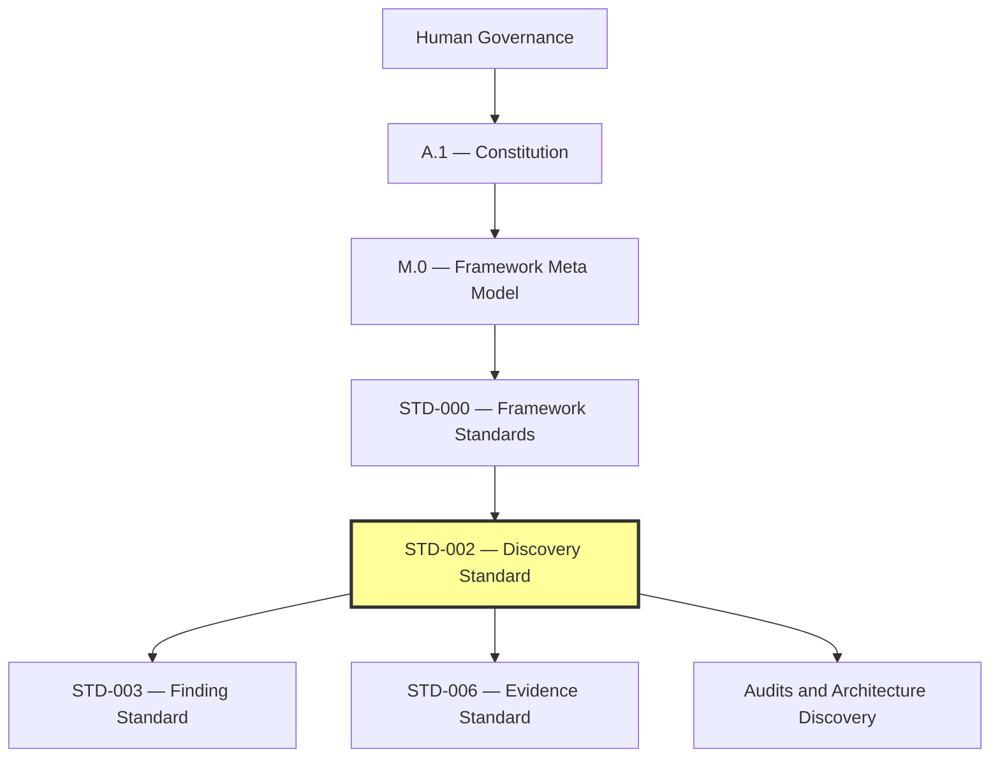
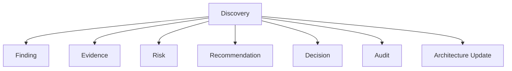
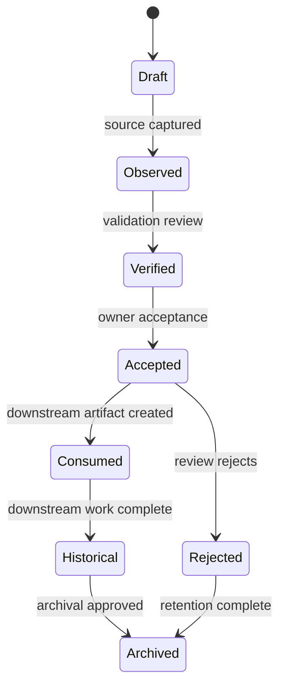

# STD-002 — Discovery Standard

> **Forge AI v3 · Standards Library**  
> Standards Library · Core Standard

---

| |                                                                                                                                                                               |
|:---|:------------------------------------------------------------------------------------------------------------------------------------------------------------------------------|
| **Document** | STD-002 — Discovery Standard                                                                                                                                                  |
| **Identifier** | `FORGE-STD-002`                                                                                                                                                               |
| **Version** | `1.0.0-draft`                                                                                                                                                                 |
| **Status** | Draft                                                                                                                                                                         |
| **Type** | Framework Standard                                                                                                                                                            |
| **Classification** | Core                                                                                                                                                                 |
| **Domain Taxonomy** | Discovery Standard                                                                                                                                                            |
| **Authority** | [A.1 — Constitution](../A.1-Constitution.md), [M.0 — Framework Meta Model](../M.0-Framework-Meta-Model.md), [STD-000 — Framework Standards](./STD-000-Framework-Standards.md) |
| **Owner** | Framework Governance                                                                                                                                                          |
| **Maintainers** | Framework Architecture Team                                                                                                                                                   |
| **Created** | 2026-07-04                                                                                                                                                                    |
| **Last Updated** | 2026-07-04                                                                                                                                                                    |
| **Depends On** | `FORGE-STD-000`, `FORGE-STD-001`, `FORGE-META-000`, `FORGE-A-001`                                                                                                                                             |
| **Consumed By** | `FORGE-STD-003`, `FORGE-STD-004`, `FORGE-STD-005`, `FORGE-STD-006`, audits, architecture discovery, runtime analysis, governance review                                       |
| **Produces** | Discovery Artifact, Discovery Record, Discovery Registry Entry, Discovery Lifecycle, Discovery Metadata Schema                                                                |

---

## Revision History

| Version | Date | Author | Description |
|:---|:---|:---|:---|
| 1.0.0-draft | 2026-07-04 | Framework Architecture Team | Initial draft of the canonical Discovery Standard. |

---

## Table of Contents

1. [Status](#1-status)
2. [Preamble](#2-preamble)
3. [Purpose](#3-purpose)
4. [Scope](#4-scope)
5. [Authority](#5-authority)
6. [Relationship to M.0](#6-relationship-to-m0)
7. [Discovery Philosophy](#7-discovery-philosophy)
8. [Discovery Classification](#8-discovery-classification)
9. [Discovery Lifecycle](#9-discovery-lifecycle)
10. [Discovery Identity](#10-discovery-identity)
11. [Discovery Structure](#11-discovery-structure)
12. [Discovery Relationships](#12-discovery-relationships)
13. [Governance](#13-governance)
14. [Validation](#14-validation)
15. [Certification](#15-certification)
16. [Versioning](#16-versioning)
17. [Migration](#17-migration)
18. [References](#18-references)
19. [Glossary](#19-glossary)
20. [Next Standard](#20-next-standard)
21. [Discovery Taxonomy](#21-discovery-taxonomy)
22. [Discovery Metadata Schema](#22-discovery-metadata-schema)
23. [Discovery Dependency Matrix](#23-discovery-dependency-matrix)
24. [Discovery Lifecycle State Machine](#24-discovery-lifecycle-state-machine)
25. [Discovery Severity Model](#25-discovery-severity-model)
26. [Discovery Confidence Model](#26-discovery-confidence-model)
27. [Discovery Impact Matrix](#27-discovery-impact-matrix)
28. [Discovery Registry](#28-discovery-registry)
29. [Discovery Decision Record](#29-discovery-decision-record)
30. [AI Discovery Rules](#30-ai-discovery-rules)
- [Appendices](#appendices)

---

## 1. Status

### Document Identity

STD-002 is the canonical Framework Standard for Discovery within the Forge AI Standards Library.

A Discovery is a governed architectural observation captured before it becomes a Finding, Recommendation, Risk, Evidence item, Decision, or implementation task.

### Standard Position

STD-002 is the first specialized standard after STD-000.

STD-000 defines how standards are governed, structured, validated, certified, versioned, migrated, and consumed. STD-002 specializes that governance model for the Discovery Artifact.



### Standard Classification

STD-002 is classified as a **Core Standard** because Discovery is a foundational input to audits, findings, recommendations, risks, evidence, decisions, validation, and governance.

### Authority Chain

If STD-002 conflicts with A.1, M.0, or STD-000, the higher authority prevails.

```text
Human Governance
    ↓
A.1 — Constitution
    ↓
M.0 — Framework Meta Model
    ↓
STD-000 — Framework Standards
    ↓
STD-002 — Discovery Standard
```

### Consumers

STD-002 is consumed by:

- Framework audits
- Architecture discovery documents
- Finding records
- Recommendation records
- Risk records
- Evidence records
- Governance reviews
- Runtime analysis
- Agent observations
- Swarm observations
- Migration analysis
- Readiness assessments

### Produced Assets

STD-002 produces:

- Discovery Artifact model
- Discovery Record structure
- Discovery lifecycle
- Discovery classification model
- Discovery confidence model
- Discovery impact model
- Discovery registry model
- AI Discovery rules

### Success Criteria

STD-002 is successful when every architectural observation can be captured, classified, governed, validated, traced, and consumed without becoming premature architectural truth.

### Completion Statement

The Status section is complete when STD-002 has a stable identity, authority chain, classification, consumers, produced assets, and success criteria.

---

## 2. Preamble

Discovery exists because Framework evolution begins with observation, not decision.

An observation may be valuable, but it is not automatically a Finding, Risk, Recommendation, Evidence item, or Architecture Decision. Without a governed Discovery model, observations can become undocumented assumptions, duplicated claims, hidden risks, or premature architectural truth.

STD-002 establishes Discovery as the first governed intake point for architectural knowledge.

Discovery protects the Framework from the following failures:

- undocumented assumptions becoming design decisions;
- AI-generated claims being treated as facts without verification;
- audit observations being mixed with findings;
- evidence being created without source traceability;
- risks being asserted without classification;
- implementation work beginning before the observation is validated.

Discovery is intentionally lightweight at intake and strict at promotion.

### Guiding Statement

A Discovery records what has been observed. It does not decide what the observation means.

### Completion Statement

The Preamble is complete when the reason for Discovery, its protective role, and its distinction from downstream artifacts are established.

---

## 3. Purpose

### Overview

The purpose of STD-002 is to define the canonical model for capturing, managing, validating, and consuming Discoveries across the Forge AI Framework.

### Objectives

STD-002 shall:

- define Discovery as a governed Artifact;
- define Discovery identity, lifecycle, metadata, classification, confidence, and impact;
- prevent observations from becoming architectural truth prematurely;
- establish traceability from observation to Finding, Evidence, Recommendation, Risk, or Decision;
- support human, AI agent, runtime, audit, and swarm-generated observations;
- ensure discoveries remain technology-neutral and framework-governed.

### Strategic Role

Discovery is the first stage of the evidence-driven knowledge pipeline:

```text
Reality
    ↓
Discovery
    ↓
Finding
    ↓
Evidence
    ↓
Recommendation / Risk / Decision
    ↓
Implementation / Governance Action
    ↓
Validation
```

### Non-Goals

STD-002 does not:

- define Findings;
- define Evidence;
- define Recommendations;
- define Risks;
- certify architecture;
- approve implementation;
- update Project Status;
- replace audits;
- replace human governance.

### Completion Statement

The Purpose section is complete when Discovery's objective, strategic role, and non-goals are explicitly defined.

---

## 4. Scope

### In Scope

STD-002 governs:

- Discovery Records;
- Discovery metadata;
- Discovery classification;
- Discovery lifecycle;
- Discovery confidence;
- Discovery severity;
- Discovery impact;
- Discovery relationships;
- Discovery validation;
- Discovery registry entries;
- Discovery consumption rules;
- AI-generated Discovery constraints.

### Out of Scope

STD-002 does not govern:

- final Finding structure;
- Evidence schemas;
- Recommendation lifecycle;
- Risk ownership;
- Decision approval;
- source-code implementation;
- platform-specific runtime behavior;
- business-domain discovery workflows.

### Boundary Rules

A Discovery shall not:

- claim canonical truth;
- prescribe implementation;
- update architecture by itself;
- override higher authority;
- bypass validation or review;
- duplicate Findings, Evidence, Recommendations, or Risks.

### Completion Statement

The Scope section is complete when Discovery inclusions, exclusions, and boundary rules are defined.

---

## 5. Authority

### Authority Principles

Discovery authority is delegated, not supreme.

Any human, AI agent, reviewer, auditor, runtime process, or governance actor may create a Discovery when authorized by the active workflow. However, creation authority is not acceptance authority.

### Authority Responsibilities

| Role | Responsibility |
|:---|:---|
| Human Governance | Final escalation authority for disputed or high-impact Discoveries. |
| Framework Governance | Approves Discovery governance rules and resolves classification disputes. |
| Standards Owner | Maintains STD-002 and its appendices. |
| Discovery Owner | Owns a specific Discovery from creation through closure. |
| Reviewer | Validates Discovery completeness, traceability, confidence, and classification. |
| AI Agent | May propose Discovery Records within assigned scope. |

### Authority Constraints

A Discovery actor shall not:

- promote a Discovery to Finding without the required workflow;
- self-certify a Discovery as canonical evidence;
- modify constitutional authority;
- override STD-000 lifecycle rules;
- treat AI confidence as human approval.

### Conflict Resolution

Discovery conflicts shall be resolved in this order:

1. Human Governance
2. A.1 — Constitution
3. M.0 — Framework Meta Model
4. STD-000 — Framework Standards
5. STD-002 — Discovery Standard
6. Owning audit, workflow, or project document

### Completion Statement

The Authority section is complete when Discovery creation, ownership, review, and conflict resolution authority are defined.

---

## 6. Relationship to M.0

### Overview

STD-002 derives Discovery from M.0 Artifact concepts.

A Discovery is a specialized Artifact with identity, owner, authority, lifecycle, state, relationships, references, evidence links, validation status, and review status.

### Derivation Model

| M.0 Concept | STD-002 Specialization |
|:---|:---|
| Artifact | Discovery Artifact |
| Identity | Discovery Identifier |
| Lifecycle | Discovery Lifecycle |
| State | Discovery State |
| Owner | Discovery Owner |
| Authority | Discovery Authority |
| Relationship | Discovery Relationship |
| Reference | Discovery Source Reference |
| Evidence | Supporting Evidence Reference |
| Validation | Discovery Validation |
| Review | Discovery Review |
| Certification | Discovery Acceptance / Consumption status |

### Reuse Rules

STD-002 shall reuse M.0 definitions for identity, ownership, authority, lifecycle, state, relationships, references, evidence, validation, review, and certification.

STD-002 may specialize these concepts for Discovery but shall not redefine their core meaning.

### Completion Statement

The Relationship to M.0 section is complete when Discovery is derived from Meta Model concepts without replacing them.

---

## 7. Discovery Philosophy

### Core Principles

| Principle | Description |
|:---|:---|
| Observation Before Decision | A Discovery captures what was observed before deciding what it means. |
| Evidence Before Assumption | A Discovery shall identify sources and evidence gaps. |
| Confidence Is Explicit | Confidence shall be declared and justified. |
| Impact Is Separate From Confidence | A low-confidence Discovery may have high potential impact. |
| Traceability Is Mandatory | Every Discovery shall trace to source, owner, lifecycle state, and downstream consumption. |
| No Premature Truth | Discovery shall not become architecture until validated and consumed through proper standards. |
| Human Review Remains Available | High-impact or disputed Discoveries shall be reviewable by human governance. |

### Design Values

Discoveries should be:

- small enough to validate;
- specific enough to trace;
- neutral enough to avoid premature conclusions;
- structured enough for AI and human review;
- reusable by Finding, Evidence, Risk, and Recommendation standards.

### Completion Statement

The Discovery Philosophy section is complete when the principles and design values governing Discovery are defined.

---

## 8. Discovery Classification

### Overview

Discovery classification describes the domain in which an observation was made.

Each Discovery shall have exactly one primary classification. Secondary tags may be used for indexing, but they shall not replace the primary classification.

### Primary Classifications

| Classification | Description |
|:---|:---|
| Architecture Discovery | Observation about structure, boundaries, ownership, dependency, or authority. |
| Runtime Discovery | Observation about execution behavior, lifecycle, orchestration, or runtime state. |
| Governance Discovery | Observation about approval, compliance, authority, lifecycle, or policy. |
| Planning Discovery | Observation about phases, stages, capabilities, tasks, or roadmap structure. |
| Validation Discovery | Observation about quality gates, test evidence, checks, or validation gaps. |
| Documentation Discovery | Observation about documentation completeness, consistency, duplication, or drift. |
| Dependency Discovery | Observation about dependency direction, hidden coupling, circularity, or layer leakage. |
| Ownership Discovery | Observation about accountability, duplicate ownership, missing ownership, or drift. |
| Risk Discovery | Observation that may become a formal Risk. |
| Migration Discovery | Observation about compatibility, transition, deprecation, or migration impact. |
| Agent Discovery | Observation produced by or about AI agents. |
| Swarm Discovery | Observation produced by or about multi-agent/swarm behavior. |
| Knowledge Discovery | Observation about reusable knowledge, knowledge graph, or knowledge integrity. |
| Memory Discovery | Observation about retained context, memory update, or future context. |
| Platform Discovery | Observation about platform adapters or host-specific behavior. |
| Security Discovery | Observation about security posture, exposure, access, or trust boundary. |
| Performance Discovery | Observation about performance, scalability, latency, or resource usage. |
| Compliance Discovery | Observation about regulatory, policy, or internal compliance alignment. |

### Classification Constraints

A Discovery shall not be classified by convenience. The classification shall describe the observed domain, not the desired next action.

### Completion Statement

The Discovery Classification section is complete when the primary classification set and classification constraints are defined.

---

## 9. Discovery Lifecycle

### Lifecycle States

```text
Draft
    ↓
Observed
    ↓
Verified
    ↓
Accepted
    ↓
Consumed
    ↓
Historical
    ↓
Archived
```

### State Definitions

| State | Meaning |
|:---|:---|
| Draft | The Discovery Record is being prepared and may be incomplete. |
| Observed | The observation has been captured with source information. |
| Verified | The observation has been checked for source validity and internal consistency. |
| Accepted | The Discovery is accepted as a valid governed observation. |
| Consumed | The Discovery has been consumed by a Finding, Evidence item, Risk, Recommendation, Decision, audit, or architecture update. |
| Historical | The Discovery remains available for traceability but is no longer active. |
| Archived | The Discovery is retained for historical record and no longer participates in active workflows. |

### Transition Rules

| Transition | Requirement |
|:---|:---|
| Draft → Observed | Minimum metadata and source reference exist. |
| Observed → Verified | Source, scope, classification, and confidence have been reviewed. |
| Verified → Accepted | Owner accepts the Discovery as valid within scope. |
| Accepted → Consumed | Downstream artifact references the Discovery. |
| Consumed → Historical | Downstream action is complete or Discovery is superseded. |
| Historical → Archived | Governance or owner authorizes archival. |

### Lifecycle Constraints

A Discovery shall not:

- skip from Draft to Accepted;
- become Consumed without a downstream reference;
- become Historical without a disposition;
- lose its original source reference;
- be deleted after acceptance unless governance explicitly authorizes removal.

### Completion Statement

The Discovery Lifecycle section is complete when states, transition rules, and lifecycle constraints are defined.

---

## 10. Discovery Identity

### Identifier Format

Canonical Discovery identifiers use this format:

```text
DISC-<DOMAIN>-<YYYYMMDD>-<SEQ>
```

Examples:

```text
DISC-ARCH-20260704-001
DISC-RUNTIME-20260704-002
DISC-GOV-20260704-003
```

### Identity Components

Every Discovery shall declare:

- Discovery Identifier
- Title
- Classification
- Version
- Lifecycle State
- Owner
- Authority
- Source
- Created Date
- Last Updated Date
- Confidence Level
- Impact Level
- Relationships

### Identity Constraints

A Discovery shall not:

- share an identifier with another Discovery;
- change identifier after Accepted state;
- omit owner or authority;
- omit lifecycle state;
- use ambiguous titles as identity.

### Completion Statement

The Discovery Identity section is complete when identifier format, identity components, and constraints are defined.

---

## 11. Discovery Structure

### Canonical Structure

Every Discovery Record shall include:

1. Discovery Header
2. Observation Statement
3. Classification
4. Scope
5. Source References
6. Context
7. Evidence References
8. Confidence Assessment
9. Impact Assessment
10. Related Artifacts
11. Validation Status
12. Review Status
13. Disposition
14. Revision History

### Discovery Header

| Field | Required | Description |
|:---|:---:|:---|
| Identifier | Yes | Stable Discovery identifier. |
| Title | Yes | Human-readable title. |
| Classification | Yes | Primary Discovery classification. |
| State | Yes | Lifecycle state. |
| Owner | Yes | Accountable Discovery Owner. |
| Authority | Yes | Governing authority. |
| Created | Yes | Creation date. |
| Updated | Yes | Last update date. |
| Confidence | Yes | Current confidence level. |
| Impact | Yes | Current impact level. |

### Observation Statement

The observation statement shall describe what was observed, not what should be done.

Good:

```text
A.4 and A.7 define Governance with overlapping language and no explicit canonical owner.
```

Bad:

```text
Rewrite A.4 and A.7 immediately.
```

### Completion Statement

The Discovery Structure section is complete when the canonical record structure and minimum required fields are defined.

---

## 12. Discovery Relationships

### Relationship Model

A Discovery may relate to other artifacts as follows:



### Relationship Types

| Relationship | Meaning |
|:---|:---|
| supports | Discovery supports a downstream artifact. |
| refines | Discovery clarifies an earlier Discovery. |
| supersedes | Discovery replaces an earlier Discovery. |
| duplicates | Discovery overlaps an existing Discovery. |
| contradicts | Discovery conflicts with another artifact and requires review. |
| consumes | A downstream artifact consumes the Discovery. |
| blocks | Discovery prevents safe progression until resolved. |

### Relationship Constraints

Relationships shall be explicit, directional, and traceable.

A Discovery shall not silently duplicate, replace, or contradict another artifact without declaring the relationship.

### Completion Statement

The Discovery Relationships section is complete when allowed relationships, meanings, and constraints are defined.

---

## 13. Governance

### Governance Requirements

Discovery governance ensures observations remain controlled, reviewable, and traceable.

Every Discovery shall have:

- owner;
- authority;
- lifecycle state;
- source reference;
- classification;
- confidence level;
- impact level;
- disposition.

### Review Requirements

Discovery review is required when:

- confidence is low and impact is high;
- the Discovery affects constitutional authority;
- the Discovery alleges ownership duplication;
- the Discovery alleges dependency violation;
- the Discovery may trigger migration;
- the Discovery is created by an AI agent and will be consumed downstream.

### Disposition Options

| Disposition | Meaning |
|:---|:---|
| Promote to Finding | Discovery becomes input to STD-003 Finding workflow. |
| Link to Evidence | Discovery becomes input to STD-006 Evidence workflow. |
| Open Risk | Discovery becomes input to STD-005 Risk workflow. |
| Create Recommendation | Discovery becomes input to STD-004 Recommendation workflow. |
| Create Decision Record | Discovery requires governance decision. |
| Monitor | Discovery remains active but no immediate action is required. |
| Close — No Action | Discovery is valid but requires no action. |
| Reject | Discovery is invalid, duplicate, unsupported, or out of scope. |

### Completion Statement

The Governance section is complete when Discovery governance requirements, review triggers, and dispositions are defined.

---

## 14. Validation

### Validation Purpose

Discovery validation verifies that the Discovery is complete, traceable, classified correctly, and safe to consume.

Validation does not prove that the Discovery is architecturally true. It verifies that the Discovery is a valid governed observation.

### Validation Checks

| Check | Requirement |
|:---|:---|
| Identity | Identifier, title, owner, authority, state, and dates exist. |
| Classification | Primary classification is valid and justified. |
| Source | At least one source reference exists. |
| Scope | Observation scope is clear and bounded. |
| Confidence | Confidence level is declared and justified. |
| Impact | Impact level is declared and justified. |
| Relationships | Related artifacts are listed where known. |
| Non-Premature Truth | Discovery does not claim to be Finding, Evidence, Risk, Recommendation, or Decision. |
| AI Safety | AI-generated Discoveries declare model/user/source boundaries. |

### Validation Outcomes

| Outcome | Meaning |
|:---|:---|
| Valid | Discovery is structurally valid. |
| Valid with Observations | Discovery is usable but has advisory issues. |
| Requires Follow-Up | Discovery lacks required information. |
| Invalid | Discovery cannot be accepted. |

### Completion Statement

The Validation section is complete when Discovery validation purpose, checks, and outcomes are defined.

---

## 15. Certification

### Certification Meaning

Discovery certification does not mean the Discovery is canonical architecture.

For Discovery, certification means the Discovery Record is complete, governed, reviewed, and safe for downstream consumption.

### Certification Levels

| Level | Meaning |
|:---|:---|
| Uncertified | Discovery has not passed validation. |
| Intake Certified | Discovery is structurally complete and source-linked. |
| Review Certified | Discovery has passed independent review. |
| Consumption Certified | Discovery may be used by Finding, Evidence, Recommendation, Risk, or Decision workflows. |

### Certification Prerequisites

A Discovery may be Consumption Certified only when:

- required metadata is complete;
- validation has passed;
- source references are resolvable;
- confidence and impact are declared;
- owner accepts accountability;
- review is complete when required;
- downstream usage is identified.

### Completion Statement

The Certification section is complete when certification meaning, levels, and prerequisites are defined.

---

## 16. Versioning

### Versioning Rules

Discovery Records use local revision versioning:

```text
0.1-draft
0.2-observed
0.3-verified
1.0-accepted
1.1-consumed
```

### Version Increment Rules

| Change | Version Impact |
|:---|:---|
| Metadata correction | Patch revision. |
| Source added | Minor revision. |
| Confidence changed | Minor revision. |
| Impact changed | Minor revision. |
| Classification changed | Minor revision and review. |
| Observation statement changed after Accepted | Major revision or supersession. |
| Discovery superseded | New Discovery identifier or explicit supersession relationship. |

### Versioning Constraints

Accepted Discoveries shall preserve historical revisions.

A Discovery shall not erase earlier source, confidence, impact, or disposition history.

### Completion Statement

The Versioning section is complete when Discovery version states, increment rules, and constraints are defined.

---

## 17. Migration

### Migration Purpose

Discovery migration ensures that Discovery Records remain usable when standards, meta models, classifications, lifecycle states, or registry formats evolve.

### Migration Triggers

A Discovery migration may be required when:

- STD-002 changes classification taxonomy;
- M.0 changes Artifact, Identity, Lifecycle, or Evidence concepts;
- STD-003, STD-004, STD-005, or STD-006 changes relationship expectations;
- Discovery Registry schema changes;
- a constitutional amendment changes evidence, authority, or human-governance requirements.

### Migration Requirements

Migration shall preserve:

- original identifier;
- original observation statement;
- source references;
- lifecycle history;
- downstream relationships;
- disposition history.

### Completion Statement

The Migration section is complete when Discovery migration triggers and preservation requirements are defined.

---

## 18. References

### Normative References

| Reference | Description |
|:---|:---|
| [A.1 — Constitution](../A.1-Constitution.md) | Constitutional authority and invariants. |
| [M.0 — Framework Meta Model](../M.0-Framework-Meta-Model.md) | Conceptual type system consumed by Discovery. |
| [STD-000 — Framework Standards](./STD-000-Framework-Standards.md) | Standards governance, structure, lifecycle, validation, certification, versioning, and migration. |
| [STD-001 — Knowledge Graph Standard](./STD-001-Knowledge-Graph-Standard.md) | Canonical knowledge graph model, node/edge semantics, topology constraints, and traversal rules. Discovery graph projections are defined against this specification. |

### Informative References

| Reference | Description |
|:---|:---|
| [A.0 — Framework Audit](../A.0-Framework-Audit.md) | Audit baseline where Discovery-style observations, evidence, gaps, risks, and recommendations are used. |
| STD-003 — Finding Standard | Planned downstream consumer of Discovery. |
| STD-004 — Recommendation Standard | Planned downstream consumer of Discovery and Finding. |
| STD-005 — Risk Standard | Planned downstream consumer of Discovery. |
| STD-006 — Evidence Standard | Planned evidence model related to Discovery. |

### Completion Statement

The References section is complete when normative and informative references are listed with their relationship to STD-002.

---

## 19. Glossary

| Term | Definition |
|:---|:---|
| Discovery | A governed observation captured before it becomes a Finding, Evidence item, Risk, Recommendation, Decision, or implementation task. |
| Discovery Artifact | The standardized artifact type governed by STD-002. |
| Discovery Record | A concrete instance of a Discovery Artifact. |
| Discovery Owner | The accountable owner responsible for lifecycle, validation, and disposition of a Discovery. |
| Discovery Confidence | The declared reliability level of a Discovery based on source quality and verification status. |
| Discovery Impact | The potential architectural, governance, operational, or implementation effect if the Discovery is confirmed. |
| Discovery Disposition | The outcome assigned to a Discovery after review or governance assessment. |
| Consumed Discovery | A Discovery that has been used by a downstream artifact such as Finding, Evidence, Risk, Recommendation, or Decision. |
| Observation Statement | The neutral statement describing what was observed. |
| Premature Truth | Treating an unvalidated Discovery as canonical architecture or implementation authority. |

### Completion Statement

The Glossary section is complete when STD-002 terms are defined consistently with higher-authority terminology.

---

## 20. Next Standard

The next Framework Standard is:

| Property | Value |
|:---|:---|
| **Identifier** | `FORGE-STD-003` |
| **Title** | STD-003 — Finding Standard |
| **Status** | Planned |
| **Role** | Defines the canonical Finding Artifact derived from one or more Discoveries and supported by Evidence. |

### Dependency from STD-002 to STD-003

STD-003 shall consume STD-002 by requiring every Finding to identify the Discovery or Discoveries from which it was derived, unless a governance-approved exception exists.

### Completion Statement

The Next Standard section is complete when the immediate successor and its dependency on Discovery are defined.

---

## 21. Discovery Taxonomy

### Overview

Discovery Taxonomy provides a structured domain model for organizing Discoveries across the Framework.

### Taxonomy Dimensions

| Dimension | Values |
|:---|:---|
| Domain | Architecture, Runtime, Governance, Planning, Validation, Documentation, Dependency, Ownership, Risk, Migration, Agent, Swarm, Knowledge, Memory, Platform, Security, Performance, Compliance |
| Source Type | Human, AI Agent, Runtime, Audit, Test, Review, Governance, External Reference |
| Confidence | Observed, Likely, Verified, Confirmed, Canonical Evidence |
| Impact | Low, Medium, High, Critical, Framework-Critical |
| Urgency | Passive, Monitor, Review Required, Immediate Review, Blocker |
| Disposition | Promote, Link, Open Risk, Recommend, Decide, Monitor, Close, Reject |

### Taxonomy Rule

Taxonomy values shall support classification and review. They shall not replace owner judgment, governance review, or evidence validation.

### Completion Statement

The Discovery Taxonomy section is complete when the primary taxonomy dimensions and taxonomy rule are defined.

---

## 22. Discovery Metadata Schema

### Canonical Metadata Schema

```yaml
id: DISC-ARCH-20260704-001
title: Governance definition overlap discovered
standard: FORGE-STD-002
version: 0.3-verified
state: Verified
classification: Architecture Discovery
source_type: Audit
owner: Framework Architecture Team
authority: Framework Governance
created: 2026-07-04
updated: 2026-07-04
confidence: Verified
impact: High
urgency: Review Required
source_references:
  - A.0-Framework-Audit.md#12-terminology-audit
related_artifacts:
  - FORGE-STD-003
  - FORGE-STD-006
disposition: Promote to Finding
validation_status: Valid
review_status: Pending
```

### Required Fields

| Field | Required | Description |
|:---|:---:|:---|
| id | Yes | Discovery identifier. |
| title | Yes | Human-readable title. |
| standard | Yes | Governing standard. |
| version | Yes | Discovery record version. |
| state | Yes | Discovery lifecycle state. |
| classification | Yes | Primary classification. |
| source_type | Yes | Origin type. |
| owner | Yes | Accountable owner. |
| authority | Yes | Governing authority. |
| created | Yes | Creation date. |
| updated | Yes | Last updated date. |
| confidence | Yes | Confidence level. |
| impact | Yes | Impact level. |
| source_references | Yes | Source references. |
| disposition | Yes | Current disposition. |

### Completion Statement

The Discovery Metadata Schema section is complete when a machine-readable schema, required fields, and usage expectations are defined.

---

## 23. Discovery Dependency Matrix

| Discovery Concern | Depends On | Produces | Consumed By |
|:---|:---|:---|:---|
| Identity | M.0 Identity, STD-000 Identity | Discovery Identifier | Registry, Validation, Review |
| Lifecycle | M.0 Lifecycle, STD-000 Lifecycle | Discovery State | Governance, Registry |
| Classification | STD-002 Classification | Classification record | Review, Registry, Metrics |
| Source Reference | M.0 Reference | Source trace | Evidence, Finding |
| Confidence | STD-002 Confidence Model | Confidence assessment | Review, Risk, Decision |
| Impact | STD-002 Impact Matrix | Impact assessment | Governance, Risk, Decision |
| Disposition | Governance | Next action | Finding, Evidence, Risk, Recommendation, Decision |

### Dependency Constraints

Discovery dependencies shall flow from higher authority to specialized Discovery behavior. Downstream artifacts may consume Discovery but shall not redefine Discovery.

### Completion Statement

The Discovery Dependency Matrix section is complete when Discovery dependencies, outputs, consumers, and constraints are defined.

---

## 24. Discovery Lifecycle State Machine



### State Machine Rules

- Draft records may be edited freely.
- Observed records require source preservation.
- Verified records require validation history.
- Accepted records require owner accountability.
- Consumed records require downstream references.
- Historical records remain traceable.
- Archived records remain referenceable when possible.

### Completion Statement

The Discovery Lifecycle State Machine section is complete when lifecycle transitions are formally represented and constrained.

---

## 25. Discovery Severity Model

### Severity Definition

Severity describes the seriousness of the observed condition if the Discovery is confirmed.

| Severity | Meaning | Example |
|:---|:---|:---|
| Info | Useful observation with no immediate concern. | A document uses an older label but remains clear. |
| Low | Minor issue with limited effect. | A non-normative cross-reference is missing. |
| Medium | Material issue requiring follow-up. | A required metadata field is incomplete. |
| High | Significant architectural, governance, or validation concern. | Ownership is ambiguous across two documents. |
| Critical | Potential constitutional, authority, dependency, or safety breach. | A lower authority overrides the Constitution. |

### Severity Constraint

Severity shall not be inflated to force action. Severity shall be justified by impact and evidence.

### Completion Statement

The Discovery Severity Model section is complete when severity levels and usage constraints are defined.

---

## 26. Discovery Confidence Model

### Confidence Levels

```text
Observed
    ↓
Likely
    ↓
Verified
    ↓
Confirmed
    ↓
Canonical Evidence
```

| Confidence | Meaning |
|:---|:---|
| Observed | The observation has been captured but not verified. |
| Likely | Initial review suggests the observation is probably valid. |
| Verified | Source and context have been checked. |
| Confirmed | Independent review confirms the observation. |
| Canonical Evidence | The observation is backed by canonical evidence and can support certification or formal decisions. |

### Confidence Rules

- Confidence shall be explicit.
- Confidence shall not be inferred from AI certainty language.
- Confidence shall be supported by source quality.
- High impact plus low confidence requires review, not automatic rejection.
- Canonical Evidence requires alignment with STD-006 when STD-006 is published.

### Completion Statement

The Discovery Confidence Model section is complete when confidence levels, meanings, and rules are defined.

---

## 27. Discovery Impact Matrix

| Impact | Description | Required Response |
|:---|:---|:---|
| Low | Limited local effect. | Record and monitor. |
| Medium | May affect one document, artifact, or workflow. | Review and classify. |
| High | May affect architecture, ownership, dependency, validation, or governance. | Required review. |
| Critical | May violate constitutional authority, source-of-truth rules, or safety boundaries. | Immediate escalation. |
| Framework-Critical | May affect the integrity of the Framework Core or Standards Library. | Human Governance review. |

### Impact / Confidence Handling

| Confidence | Low Impact | Medium Impact | High Impact | Critical Impact |
|:---|:---|:---|:---|:---|
| Observed | Monitor | Review | Required Review | Escalate |
| Likely | Monitor | Review | Required Review | Escalate |
| Verified | Accept / Monitor | Accept / Promote | Promote | Escalate |
| Confirmed | Accept | Promote | Promote / Decide | Escalate |
| Canonical Evidence | Consume | Consume | Consume / Decide | Human Governance |

### Completion Statement

The Discovery Impact Matrix section is complete when impact levels and confidence-impact handling are defined.

---

## 28. Discovery Registry

### Registry Purpose

The Discovery Registry tracks active and historical Discovery Records.

### Registry Entry Schema

| Field | Description |
|:---|:---|
| Discovery ID | Stable Discovery identifier. |
| Title | Human-readable title. |
| Classification | Primary classification. |
| State | Lifecycle state. |
| Owner | Accountable owner. |
| Confidence | Current confidence. |
| Impact | Current impact. |
| Disposition | Current disposition. |
| Related Artifacts | Linked Findings, Evidence, Risks, Recommendations, Decisions. |
| Last Updated | Last modification date. |

### Registry Rules

- Accepted Discoveries shall be listed in a registry or equivalent traceability record.
- Consumed Discoveries shall identify downstream artifacts.
- Rejected Discoveries may be retained for duplicate prevention and audit traceability.
- Archived Discoveries shall remain referenceable when feasible.

### Completion Statement

The Discovery Registry section is complete when registry purpose, schema, and rules are defined.

---

## 29. Discovery Decision Record

### Purpose

A Discovery Decision Record documents a governance decision made because of one or more Discoveries.

### Decision Record Schema

| Field | Description |
|:---|:---|
| Decision ID | Stable identifier for the decision. |
| Related Discovery IDs | Discoveries that triggered the decision. |
| Decision Date | Date of decision. |
| Decision Authority | Authority that made the decision. |
| Decision | Approved action, rejection, deferral, or escalation. |
| Rationale | Reasoning and evidence basis. |
| Impact | Expected effect of the decision. |
| Follow-Up | Required downstream action. |

### Decision Constraints

A Discovery Decision Record may decide how to handle a Discovery. It shall not redefine the Discovery model or bypass downstream standards.

### Completion Statement

The Discovery Decision Record section is complete when decision record purpose, schema, and constraints are defined.

---

## 30. AI Discovery Rules

### AI Agent Rules

AI agents may create Discoveries only within assigned scope.

AI-generated Discoveries shall:

- declare source material;
- distinguish observation from inference;
- declare confidence;
- declare evidence gaps;
- avoid presenting assumptions as facts;
- avoid converting Discoveries into implementation tasks without workflow authorization;
- request review for high-impact Discoveries;
- preserve higher-authority rules.

### Forbidden AI Behaviors

AI agents shall not:

- invent sources;
- fabricate evidence;
- self-certify Discovery as canonical evidence;
- override human governance;
- update Project Status solely because a Discovery exists;
- treat model confidence as validation;
- silently merge multiple Discoveries into one conclusion;
- classify downstream action before recording observation.

### AI Discovery Output Minimum

An AI-generated Discovery shall include:

```text
Observation
Source
Scope
Confidence
Impact
Evidence Gap
Recommended Disposition
```

### Completion Statement

The AI Discovery Rules section is complete when agent permissions, required behavior, forbidden behavior, and minimum output requirements are defined.

---

## Appendices

The following appendices are defined for STD-002:

| Appendix | Title | Status |
|:---|:---|:-------|
| Appendix A | Discovery Classification Catalog | Draft  |
| Appendix B | Discovery Templates | Draft  |
| Appendix C | Discovery Examples | Draft  |
| Appendix D | Discovery Checklist | Draft  |
| Appendix E | Discovery Decision Matrix | Draft  |
| Appendix F | Discovery Taxonomy | Draft  |
| Appendix G | Discovery Metadata Schema | Draft  |
| Appendix H | Discovery Lifecycle Examples | Draft  |

---

## Document Completion Checklist

- [x] Status defined
- [x] Preamble defined
- [x] Purpose defined
- [x] Scope defined
- [x] Authority defined
- [x] Relationship to M.0 defined
- [x] Discovery philosophy defined
- [x] Classification defined
- [x] Lifecycle defined
- [x] Identity defined
- [x] Structure defined
- [x] Relationships defined
- [x] Governance defined
- [x] Validation defined
- [x] Certification defined
- [x] Versioning defined
- [x] Migration defined
- [x] References defined
- [x] Glossary defined
- [x] Next standard identified
- [x] Enterprise extensions defined
- [x] Appendices defined

